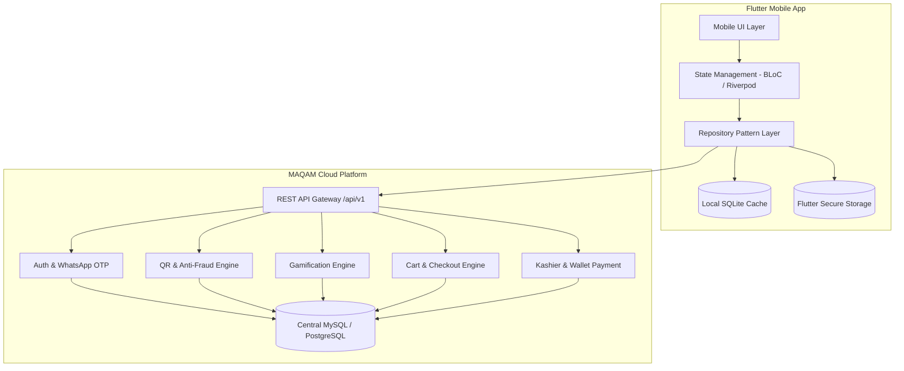
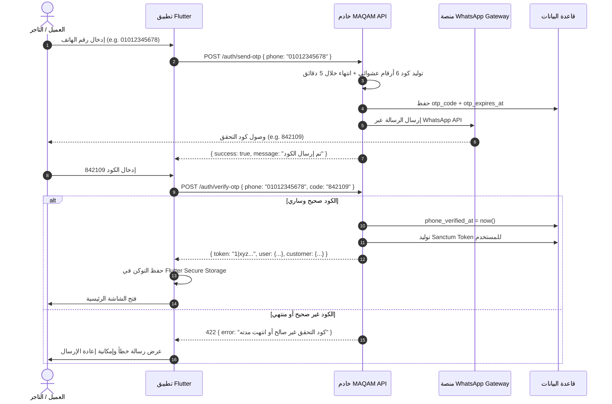
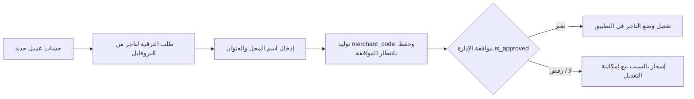
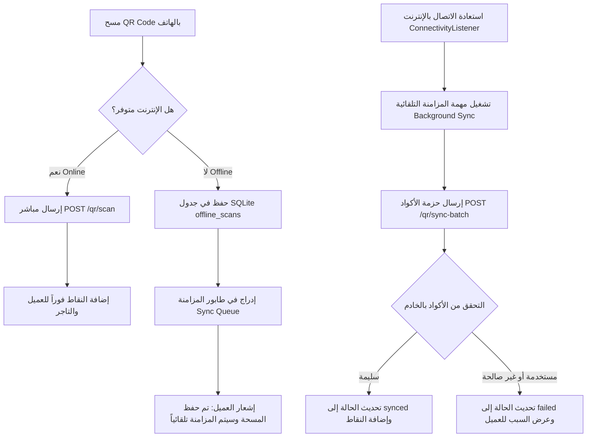
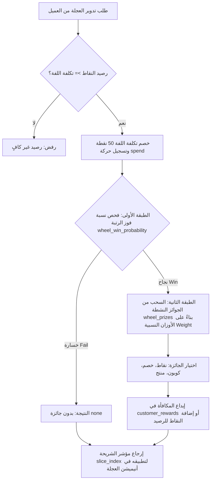

# 📱 الدليل الشامل لمطور الفلاتر — منظومة مقام (MAQAM Flutter Developer Handbook)

> **الإصدار:** 1.0.0  
> **تاريخ الإعداد:** سبتمبر 2026  
> **المرجع التقني الأساسي:** منصة مقام للولاء والتجارة الإلكترونية (MAQAM Loyalty & E-Commerce Platform)  
> **بيئة الـ API الأساسية:** `https://maqam-eg.com/api/v1/`  
> **البيئة التجريبية (Staging):** `https://staging.maqam-eg.com/api/v1/`  

---

## 📑 فهرس المحتويات (Table of Contents)

1. [مقدمة وهيكلية النظام لتطبيق Flutter (System Architecture)](#1-مقدمة-وهيكلية-النظام-لتطبيق-flutter)
2. [قواعد الاتصال ومعايير الـ API (API Conventions & Standards)](#2-قواعد-الاتصال-ومعايير-الـ-api)
3. [بيانات قاعدة البيانات المركزية الشاملة (Complete DB Schema)](#3-بيانات-قاعدة-البيانات-المركزية-الشاملة)
4. [نماذج البيانات وكلاسات Dart (Models & Dart Data Classes)](#4-نماذج-البيانات-وكلاسات-dart)
5. [قاعدة البيانات المحلية للتطبيق (SQLite Offline Schema)](#5-قاعدة-البيانات-المحلية-للتطبيق-sqlite-offline-schema)
6. [مخططات وتدفقات العمليات (Data Flows & Sequence Diagrams)](#6-مخططات-وتدفقات-العمليات-data-flows)
   - [6.1 المصادقة والتسجيل عبر WhatsApp OTP](#61-المصادقة-والتسجيل-عبر-whatsapp-otp)
   - [6.2 الدخول الحيوي (Biometrics)](#62-الدخول-الحيوي-biometrics)
   - [6.3 نظام الأدوار وترقية التاجر (Roles & Merchant Upgrade)](#63-نظام-الأدوار-وترقية-التاجر)
   - [6.4 مسح أكواد QR وربط التاجر (QR Scanning & Merchant Linking)](#64-مسح-أكواد-qr-وربط-التاجر)
   - [6.5 العمل أوفلاين والمزامنة التلقائية (Offline Sync Engine)](#65-العمل-أوفلاين-والمزامنة-التلقائية)
   - [6.6 محفظة الولاء والرتب (Loyalty Wallet & Ranks)](#66-محفظة-الولاء-والرتب)
   - [6.7 عجلة الحظ وخوارزمية التلعيب (Lucky Wheel Engine)](#67-عجلة-الحظ-وخوارزمية-التلعيب)
   - [6.8 محفظة الجوائز والكوبونات (Rewards Wallet)](#68-محفظة-الجوائز-والكوبونات)
   - [6.9 السلة الموحدة والمتجر (Unified Cart & Store)](#69-السلة-الموحدة-والمتجر)
   - [6.10 الشراء والدفع بوابات Kashier / COD / Wallet](#610-الشراء-والدفع-بوابات-kashier--cod--wallet)
   - [6.11 الإشعارات والتنبيهات (Push Notifications)](#611-الإشعارات-والتنبيهات)
   - [6.12 محرك مكافحة الاحتيال (Anti-Fraud & Geo-Velocity)](#612-محرك-مكافحة-الاحتيال)
7. [التوصيف الدقيق لجميع دوال ونقاط النهاية (API Endpoints & Functions Reference)](#7-التوصيف-الدقيق-لجميع-دوال-ونقاط-النهاية)
8. [حالات الخطأ والتنبيهات (Error Handling & HTTP Status Codes)](#8-حالات-الخطأ-والتنبيهات)
9. [توصيات معمارية لكود Flutter (Recommended App Architecture)](#9-توصيات-معمارية-لكود-flutter)

---

## 1. مقدمة وهيكلية النظام لتطبيق Flutter

تطبيق **مقام (MAQAM)** مبني بنظام **Single Codebase** موحد يخدم كلاً من:
1. **العميل العادي (Customer):** تصفح وشراء المنتجات، كسب نقاط الولاء بمسح أكواد الـ QR، تدوير عجلة الحظ، استبدال واستخدام الكوبونات، تتبع الطلبات.
2. **التاجر (Merchant):** يملك رمز تاجر فريد (`merchant_code`)؛ عندما يمسح العميل الكود مشيراً للتاجر أو يختاره من القائمة، يحصل التاجر على نقاط أيضاً بناءً على رتبة العميل.
3. **العمل دون اتصال (Offline-First Scanning):** إمكانية مسح مئات الأكواد دون إنترنت في المخازن أو الورش وحفظها في SQLite، وتتم مزامنتها آلياً بمجرد عودة الاتصال.



---

## 2. قواعد الاتصال ومعايير الـ API

### 2.1 الروابط الأساسية (Base URLs)
* **الإنتاج (Production):** `https://maqam-eg.com/api/v1`
* **التطوير (Staging):** `https://staging.maqam-eg.com/api/v1`

### 2.2 ترويسات الطلب الإلزامية (Request Headers)
```http
Accept: application/json
Content-Type: application/json
Authorization: Bearer <SANCTUM_ACCESS_TOKEN>
X-App-Locale: ar         # 'ar' أو 'en' لدعم الترجمة الديناميكية
X-Device-Id: <UUID>      # معرف فريد لجهاز الموبايل لمكافحة الاحتيال
X-App-Version: 1.0.0     # رقم إصدار التطبيق
```

### 2.3 الهيكل القياسي للاستجابة (Standard Response Envelope)

#### حالة النجاح (Success Response):
```json
{
  "success": true,
  "message": "تمت العملية بنجاح",
  "data": { ... },
  "meta": {
    "current_page": 1,
    "last_page": 5,
    "total": 50
  }
}
```

#### حالة الفشل (Error Response):
```json
{
  "success": false,
  "message": "بيانات غير صالحة أو حدث خطأ أثناء المعالجة",
  "errors": {
    "phone": ["رقم الهاتف مسجل بالفعل"],
    "serial_code": ["الكود ممسوح مسبقاً"]
  },
  "error_code": "RESOURCE_ALREADY_USED"
}
```

---

## 3. بيانات قاعدة البيانات المركزية الشاملة

فيما يلي توصيف كامل لجميع الجداول والحقول كما هي في قاعدة بيانات الخادم (Backend Migrations):

### 3.1 جدول المستخدمين الأساسي `users`
يمثل الهوية المشتركة لجميع المستخدمين (عملاء، تجار، مدراء).

| الحقل (Column) | النوع (Data Type) | القيود (Constraints) | الوصف (Description) |
|---|---|---|---|
| `id` | BIGINT UNSIGNED | PK, Auto Increment | المعرف الفريد للمستخدم |
| `phone_number` | VARCHAR(20) | UNIQUE, NOT NULL | رقم الهاتف المصري (المفتاح الأساسي للمصادقة مثل `01012345678`) |
| `email` | VARCHAR(255) | UNIQUE, NULLABLE | البريد الإلكتروني |
| `password` | VARCHAR(255) | NOT NULL | كلمة المرور المشفرة (تُنشأ تلقائياً في حالة OTP) |
| `full_name` | VARCHAR(255) | NOT NULL | اسم المستخدم بالكامل |
| `role` | VARCHAR(20) | NOT NULL, DEFAULT `'customer'` | الدور: `customer` أو `merchant` أو `admin` |
| `is_active` | BOOLEAN | NOT NULL, DEFAULT `true` | هل الحساب نشط أم مجمد من نظام المخاطر |
| `phone_verified_at` | TIMESTAMP | NULLABLE | تاريخ التحقق من رقم الهاتف عبر OTP |
| `last_login_at` | TIMESTAMP | NULLABLE | تاريخ آخر تسجيل دخول ناجح |
| `device_token` | TEXT | NULLABLE | رمز جهاز الإشعارات (Firebase Cloud Messaging Token) |
| `preferred_language` | VARCHAR(5) | DEFAULT `'ar'` | اللغة المفضلة: `'ar'` أو `'en'` |
| `face_id_enabled` | BOOLEAN | DEFAULT `false` | هل فعّل المستخدم المصادقة الحيوية |
| `face_id_token` | VARCHAR(255) | NULLABLE | رمز تحقق بيومتري مشفر ومربوط بالجهاز |
| `otp_code` | VARCHAR(6) | NULLABLE | رمز التحقق الأخير المرسل عبر واتساب |
| `otp_expires_at` | TIMESTAMP | NULLABLE | تاريخ ووقت انتهاء صلاحية كود OTP |
| `created_at` | TIMESTAMP | NULLABLE | تاريخ الإنشاء |
| `updated_at` | TIMESTAMP | NULLABLE | تاريخ آخر تحديث |

---

### 3.2 جدول العملاء `customers`
بيانات الملف الشخصي لبرنامج الولاء والنقاط للعميل (علاقة 1:1 مع `users`).

| الحقل (Column) | النوع (Data Type) | القيود (Constraints) | الوصف (Description) |
|---|---|---|---|
| `id` | BIGINT UNSIGNED | PK, Auto Increment | معرف العميل |
| `user_id` | BIGINT UNSIGNED | FK → `users.id`, UNIQUE | ربط بحساب المستخدم الأساسي |
| `rank_id` | BIGINT UNSIGNED | FK → `ranks.id`, NULLABLE | الرتبة الحالية للعميل (فضية، ذهبية، بلاتينية) |
| `points_balance` | INTEGER | NOT NULL, DEFAULT `0` | رصيد النقاط الفعلي القابل للاستهلاك |
| `total_points_earned` | INTEGER | NOT NULL, DEFAULT `0` | إجمالي النقاط المكتسبة طوال فترة الحساب (تحدد الرتبة) |
| `total_points_spent` | INTEGER | NOT NULL, DEFAULT `0` | إجمالي النقاط المنفقة (في العجلة، الخصومات) |
| `date_of_birth` | DATE | NULLABLE | تاريخ الميلاد لإرسال عروض خاصة |
| `created_at` | TIMESTAMP | NULLABLE | تاريخ الإنشاء |
| `updated_at` | TIMESTAMP | NULLABLE | تاريخ التحديث |

---

### 3.3 جدول التجار `merchants`
بيانات ملف التاجر المعتمد (علاقة 1:1 مع `users`).

| الحقل (Column) | النوع (Data Type) | القيود (Constraints) | الوصف (Description) |
|---|---|---|---|
| `id` | BIGINT UNSIGNED | PK, Auto Increment | معرف التاجر |
| `user_id` | BIGINT UNSIGNED | FK → `users.id`, UNIQUE | ربط بحساب المستخدم |
| `business_name` | VARCHAR(255) | NOT NULL | اسم المحل / النشاط التجاري |
| `business_address` | TEXT | NULLABLE | عنوان المحل الجغرافي بالتفصيل |
| `merchant_code` | VARCHAR(50) | UNIQUE, NOT NULL | **كود التاجر الفريد** (يُعطى للعملاء ليدخلوه عند المسح) |
| `is_approved` | BOOLEAN | NOT NULL, DEFAULT `false` | هل وافقت الإدارة على ملف التاجر؟ |
| `approved_at` | TIMESTAMP | NULLABLE | تاريخ الموافقة الرسمية |
| `approved_by` | BIGINT UNSIGNED | FK → `admins.id`, NULLABLE | المدير الذي اعتمد التاجر |
| `logo_url` | VARCHAR(255) | NULLABLE | رابط لوجو أو صورة المحل |
| `created_at` | TIMESTAMP | NULLABLE | تاريخ الإنشاء |
| `updated_at` | TIMESTAMP | NULLABLE | تاريخ التحديث |

---

### 3.4 جدول الرتب ومستويات الولاء `ranks`
مستويات الولاء التي تحدد امتيازات العميل ونقاط التاجر واحتمالية الفوز في عجلة الحظ.

| الحقل (Column) | النوع (Data Type) | القيود (Constraints) | الوصف (Description) |
|---|---|---|---|
| `id` | BIGINT UNSIGNED | PK, Auto Increment | معرف الرتبة |
| `name_en` | VARCHAR(50) | NOT NULL | الاسم بالإنجليزية: `Silver`, `Gold`, `Platinum` |
| `name_ar` | VARCHAR(50) | NOT NULL | الاسم بالعربية: `فضي`, `ذهبي`, `بلاتيني` |
| `min_points` | INTEGER | NOT NULL | الحد الأدنى من النقاط التراكمية لبلوغ الرتبة |
| `max_points` | INTEGER | NULLABLE | الحد الأقصى للنقاط (NULL للرتبة الأعلى) |
| `customer_points_per_scan`| INTEGER | NOT NULL | نقاط المسح الافتراضية للعميل |
| `merchant_points_per_scan`| INTEGER | NOT NULL | **نقاط التاجر الممنوحة عند مسح العميل لكود منسوب إليه** |
| `wheel_win_probability` | FLOAT | NOT NULL | احتمالية الفوز في عجلة الحظ (من `0.0` حتى `1.0`) |
| `wheel_cost_points` | INTEGER | NOT NULL, DEFAULT `50` | تكلفة اللفة الواحدة بالنقاط |
| `icon_url` | VARCHAR(255) | NULLABLE | أيقونة أو شارة الرتبة |
| `is_active` | BOOLEAN | NOT NULL, DEFAULT `true` | تفعيل الرتبة |
| `created_at` | TIMESTAMP | NULLABLE | تاريخ الإنشاء |
| `updated_at` | TIMESTAMP | NULLABLE | تاريخ التحديث |

---

### 3.5 جدول سجل حركات النقاط `points_transactions`
سجل مالي محاسبي لا يقبل الحذف لكل حركة نقاط (إضافة، خصم، استرداد).

| الحقل (Column) | النوع (Data Type) | القيود (Constraints) | الوصف (Description) |
|---|---|---|---|
| `id` | BIGINT UNSIGNED | PK, Auto Increment | معرف الحركة |
| `customer_id` | BIGINT UNSIGNED | FK → `customers.id`, NOT NULL | العميل صاحب الحركة |
| `merchant_id` | BIGINT UNSIGNED | FK → `merchants.id`, NULLABLE | التاجر المرتبط بالمعاملة (إن وجد) |
| `qr_scan_id` | BIGINT UNSIGNED | FK → `qr_scans.id`, NULLABLE | عملية المسح المسببة للنقاط |
| `type` | VARCHAR(20) | NOT NULL | نوع الحركة: `earn`, `spend`, `refund`, `expire`, `adjust` |
| `amount` | INTEGER | NOT NULL | عدد النقاط (+ للإضافة، - للخصم) |
| `description` | TEXT | NULLABLE | شرح تفصيلي للحركة بالعربية |
| `balance_after` | INTEGER | NULLABLE | رصيد العميل بعد تنفيذ الحركة مباشرة |
| `admin_id` | BIGINT UNSIGNED | FK → `admins.id`, NULLABLE | المدير في حالة التعديل اليدوي |
| `transaction_date` | TIMESTAMP | NOT NULL, DEFAULT CURRENT | وقت وتاريخ العملية |
| `created_at` | TIMESTAMP | NULLABLE | تاريخ الإنشاء |
| `updated_at` | TIMESTAMP | NULLABLE | تاريخ التحديث |

---

### 3.6 جدول فئات الهدايا والنقاط الثابتة `categories_prize`
فئات هدايا الأكواد المطبوعة؛ وهي التي تحدد النقاط الثابتة ولون الكارت المطبوع.

| الحقل (Column) | النوع (Data Type) | القيود (Constraints) | الوصف (Description) |
|---|---|---|---|
| `id` | BIGINT UNSIGNED | PK, Auto Increment | معرف الفئة |
| `name_en` | VARCHAR(100) | NOT NULL | اسم فئة الهدية بالإنجليزية |
| `name_ar` | VARCHAR(100) | NOT NULL | اسم فئة الهدية بالعربية |
| `category_type` | VARCHAR(20) | DEFAULT `'gift'` | نوع الفئة: `standard` أو `gift` |
| `points_value` | INTEGER | NOT NULL, DEFAULT `0` | **النقاط الثابتة التي يحصل عليها العميل من الكود** |
| `background_color` | VARCHAR(7) | NOT NULL, DEFAULT `'#C5A059'` | كود اللون (HEX) لخلفية كارت الطباعة |
| `image_path` | VARCHAR(255) | NULLABLE | مسار صورة الشارة / الفئة |
| `icon` | VARCHAR(255) | NULLABLE | اسم أو مسار الأيقونة |
| `is_active` | BOOLEAN | DEFAULT `true` | هل الفئة نشطة |
| `created_at` | TIMESTAMP | NULLABLE | تاريخ الإنشاء |
| `updated_at` | TIMESTAMP | NULLABLE | تاريخ التحديث |

---

### 3.7 جدول أكواد الـ QR المطبوعة `qr_codes`
كل كود يمثل قطعة مطبوعة تحت طبقة قشط مكون من 16 رقماً مشفراً.

| الحقل (Column) | النوع (Data Type) | القيود (Constraints) | الوصف (Description) |
|---|---|---|---|
| `id` | BIGINT UNSIGNED | PK, Auto Increment | معرف الكود |
| `serial_code` | VARCHAR(16) | UNIQUE, NOT NULL | الكود الرقمي التسلسلي (16 رقم) المقروء من الكاميرا |
| `category_id` | BIGINT UNSIGNED | FK → `categories_prize.id` | فئة الهدايا والنقاط |
| `points_awarded` | INTEGER | DEFAULT `0` | النقاط المثبتة على الكود عند إنشائه |
| `status` | VARCHAR(20) | DEFAULT `'active'` | حالة الكود: `active`, `used`, `expired` |
| `batch_id` | VARCHAR(50) | INDEX, NULLABLE | رقم دفعة الطباعة |
| `generated_at` | TIMESTAMP | DEFAULT CURRENT | وقت التوليد الأولي |
| `printed_at` | TIMESTAMP | NULLABLE | وقت تأكيد الطباعة |
| `sold_at` | TIMESTAMP | NULLABLE | وقت البيع أو الخروج للسوق |
| `sold_order_id` | BIGINT UNSIGNED | FK → `orders.id`, NULLABLE | الطلب الذي بيع الكود ضمنه |
| `used_at` | TIMESTAMP | NULLABLE | وقت مسح الكود من العميل |
| `used_by_customer_id`| BIGINT UNSIGNED | FK → `customers.id`, NULLABLE | العميل الذي كسب نقاط الكود |
| `created_at` | TIMESTAMP | NULLABLE | تاريخ الإنشاء |
| `updated_at` | TIMESTAMP | NULLABLE | تاريخ التحديث |

---

### 3.8 جدول عمليات المسح `qr_scans`
يسجل تفاصيل واقعة المسح في الوقت الفعلي أو بعد المزامنة من الأوفلاين.

| الحقل (Column) | النوع (Data Type) | القيود (Constraints) | الوصف (Description) |
|---|---|---|---|
| `id` | BIGINT UNSIGNED | PK, Auto Increment | معرف المسحة |
| `qr_code_id` | BIGINT UNSIGNED | FK → `qr_codes.id`, NOT NULL | الكود الممسوح |
| `customer_id` | BIGINT UNSIGNED | FK → `customers.id`, NOT NULL | العميل الماسح |
| `merchant_id` | BIGINT UNSIGNED | FK → `merchants.id`, NULLABLE | التاجر المنسوب إليه المسح (المختار بالرمز) |
| `points_awarded_customer`| INTEGER | NOT NULL | النقاط المحتسبة للعميل |
| `points_awarded_merchant`| INTEGER | DEFAULT `0` | النقاط المحتسبة للتاجر |
| `scan_location_lat`| VARCHAR(50) | NULLABLE | خط العرض الجغرافي وقت المسح |
| `scan_location_lng`| VARCHAR(50) | NULLABLE | خط الطول الجغرافي وقت المسح |
| `scanned_at` | TIMESTAMP | DEFAULT CURRENT | توقيت المسح الفعلي من الموبايل |
| `is_offline` | BOOLEAN | DEFAULT `false` | هل تم المسح أثناء انقطاع الإنترنت؟ |
| `sync_status` | VARCHAR(20) | DEFAULT `'pending'` | حالة المزامنة: `pending`, `synced`, `failed` |
| `device_id` | VARCHAR(255) | NULLABLE | معرف جهاز الموبايل |
| `created_at` | TIMESTAMP | NULLABLE | تاريخ الإنشاء |
| `updated_at` | TIMESTAMP | NULLABLE | تاريخ التحديث |

---

### 3.9 جدول فئات متجر المنتجات `categories`
فئات المنتجات المعروضة للبيع في المتجر (شجرية هرمية منفصلة عن فئات الجوائز).

| الحقل (Column) | النوع (Data Type) | القيود (Constraints) | الوصف (Description) |
|---|---|---|---|
| `id` | BIGINT UNSIGNED | PK, Auto Increment | معرف فئة المتجر |
| `name_en` | VARCHAR(100) | NOT NULL | اسم الفئة بالإنجليزية |
| `name_ar` | VARCHAR(100) | NOT NULL | اسم الفئة بالعربية |
| `slug` | VARCHAR(100) | UNIQUE, NOT NULL | الرابط المختصر |
| `parent_id` | BIGINT UNSIGNED | FK → `categories.id`, NULLABLE | الفئة الأب للتصنيف الفرعي |
| `image_path` | VARCHAR(255) | NULLABLE | صورة الفئة |
| `icon` | VARCHAR(255) | NULLABLE | اسم أيقونة الفئة |
| `is_active` | BOOLEAN | DEFAULT `true` | التفعيل |
| `created_at` | TIMESTAMP | NULLABLE | تاريخ الإنشاء |
| `updated_at` | TIMESTAMP | NULLABLE | تاريخ التحديث |

---

### 3.10 جدول المنتجات `products`

| الحقل (Column) | النوع (Data Type) | القيود (Constraints) | الوصف (Description) |
|---|---|---|---|
| `id` | BIGINT UNSIGNED | PK, Auto Increment | معرف المنتج |
| `category_id` | BIGINT UNSIGNED | FK → `categories.id` | فئة المتجر التابع لها |
| `name_en` | VARCHAR(255) | NOT NULL | اسم المنتج بالإنجليزي |
| `name_ar` | VARCHAR(255) | NOT NULL | اسم المنتج بالعربي |
| `description_en` | TEXT | NULLABLE | الوصف بالإنجليزي |
| `description_ar` | TEXT | NULLABLE | الوصف بالعربي |
| `price` | DECIMAL(10,2) | NOT NULL | السعر بالجنيه المصري EGP |
| `stock_quantity` | INTEGER | DEFAULT `0` | الكمية المتاحة في المخزن |
| `sku` | VARCHAR(100) | UNIQUE, NULLABLE | رمز SKU الفريد |
| `catalog_code` | VARCHAR(100) | NULLABLE | كود الكتالوج التجاري |
| `production_code` | VARCHAR(100) | NULLABLE | كود خط الإنتاج |
| `system_code` | VARCHAR(100) | NULLABLE | كود النظام الداخلي |
| `image_path` | VARCHAR(255) | NULLABLE | مسار الصورة الأساسية |
| `weight` | DECIMAL(8,2) | NULLABLE | وزن المنتج (لحساب الشحن) |
| `dimensions` | VARCHAR(100) | NULLABLE | الأبعاد (طول × عرض × ارتفاع) |
| `is_active` | BOOLEAN | DEFAULT `true` | هل متاح للشراء في التطبيق؟ |
| `created_at` | TIMESTAMP | NULLABLE | تاريخ الإنشاء |
| `updated_at` | TIMESTAMP | NULLABLE | تاريخ التحديث |

---

### 3.11 جدول صور المنتجات الإضافية `product_images`

| الحقل (Column) | النوع (Data Type) | القيود (Constraints) | الوصف (Description) |
|---|---|---|---|
| `id` | BIGINT UNSIGNED | PK, Auto Increment | معرف الصورة |
| `product_id` | BIGINT UNSIGNED | FK → `products.id`, CASCADE | ربط بالمنتج |
| `image_path` | VARCHAR(255) | NOT NULL | مسار الصورة |
| `is_thumbnail` | BOOLEAN | DEFAULT `false` | هل هي الصورة المصغرة الرئيسية؟ |
| `sort_order` | SMALLINT | DEFAULT `0` | ترتيب العرض في معرض الصور (Gallery) |
| `created_at` | TIMESTAMP | NULLABLE | تاريخ الإنشاء |
| `updated_at` | TIMESTAMP | NULLABLE | تاريخ التحديث |

---

### 3.12 جدول خيارات وألوان المنتجات `product_colors` & `product_options`

#### جدول `product_colors`:
| الحقل (Column) | النوع (Data Type) | القيود | الوصف |
|---|---|---|---|
| `id` | BIGINT UNSIGNED | PK | المعرف |
| `product_id` | BIGINT UNSIGNED | FK → `products.id` | ربط بالمنتج |
| `name` | VARCHAR(255) | NOT NULL | اسم اللون (أحمر، أسود ميتاليك) |
| `hex` | VARCHAR(7) | NULLABLE | كود اللون السداسي مثل `#1A1A1A` |
| `sort_order` | SMALLINT | DEFAULT `0` | الترتيب |

#### جدول `product_options`:
| الحقل (Column) | النوع (Data Type) | القيود | الوصف |
|---|---|---|---|
| `id` | BIGINT UNSIGNED | PK | المعرف |
| `product_id` | BIGINT UNSIGNED | FK → `products.id` | ربط بالمنتج |
| `name` | VARCHAR(255) | NOT NULL | اسم الخاصية (السمك، المقاس، الحجم) |
| `value` | VARCHAR(255) | NOT NULL | قيمة الخاصية (1 مم، XL، 500 مل) |
| `sort_order` | SMALLINT | DEFAULT `0` | الترتيب |

---

### 3.13 جدول السلة وعناصرها `cart` & `cart_items`

#### جدول `cart`:
| الحقل (Column) | النوع | القيود | الوصف |
|---|---|---|---|
| `id` | BIGINT UNSIGNED | PK | معرف السلة |
| `user_id` | BIGINT UNSIGNED | FK → `users.id`, NULLABLE | المستخدم المسجل (إن وجد) |
| `session_id` | VARCHAR(255) | NULLABLE | معرف الجلسة للزائر غير المسجل |
| `coupon_code` | VARCHAR(50) | NULLABLE | كود الكوبون المطبق |
| `total` | DECIMAL(10,2) | DEFAULT `0` | إجمالي السلة المحسوب |
| `expires_at` | TIMESTAMP | NOT NULL | تاريخ انتهاء الصلاحية (14 يوم) |

#### جدول `cart_items`:
| الحقل (Column) | النوع | القيود | الوصف |
|---|---|---|---|
| `id` | BIGINT UNSIGNED | PK | معرف العنصر |
| `cart_id` | BIGINT UNSIGNED | FK → `cart.id`, CASCADE | السلة التابع لها |
| `product_id` | BIGINT UNSIGNED | FK → `products.id`, CASCADE | المنتج المضاف |
| `quantity` | INTEGER | NOT NULL, DEFAULT `1` | الكمية |
| `unit_price` | DECIMAL(10,2) | NOT NULL | سعر القطعة عند الإضافة |

---

### 3.14 جدول عناوين التوصيل `shipping_addresses`

| الحقل (Column) | النوع | القيود | الوصف |
|---|---|---|---|
| `id` | BIGINT UNSIGNED | PK | معرف العنوان |
| `user_id` | BIGINT UNSIGNED | FK → `users.id`, CASCADE | المستخدم صاحب العنوان |
| `recipient_name`| VARCHAR(255) | NOT NULL | اسم مستلم الشحنة |
| `phone` | VARCHAR(20) | NOT NULL | هاتف التواصل وقت التوصيل |
| `governorate` | VARCHAR(100) | NOT NULL | المحافظة (القاهرة، الجيزة...) |
| `city` | VARCHAR(100) | NOT NULL | المدينة / الحي |
| `address_line1` | VARCHAR(255) | NOT NULL | اسم الشارع ورقم العقار والشقة |
| `address_line2` | VARCHAR(255) | NULLABLE | علامات مميزة أو ملاحظات إضافية |
| `postal_code` | VARCHAR(20) | NULLABLE | الرمز البريدي |
| `country` | VARCHAR(100) | DEFAULT `'Egypt'`| الدولة |
| `is_default` | BOOLEAN | DEFAULT `false` | هل هو العنوان الافتراضي؟ |

---

### 3.15 جدول الطلبات `orders`

| الحقل (Column) | النوع | القيود | الوصف |
|---|---|---|---|
| `id` | BIGINT UNSIGNED | PK | معرف الطلب |
| `user_id` | BIGINT UNSIGNED | FK → `users.id` | المستخدم صاحب الطلب |
| `order_number` | VARCHAR(50) | UNIQUE, NOT NULL | رقم الطلب المشفر للقراءة مثل `MQ-20260922-A8F2K` |
| `status` | VARCHAR(20) | DEFAULT `'new'` | حالة الطلب: `new`, `processing`, `shipped`, `delivered`, `cancelled`, `refunded` |
| `subtotal` | DECIMAL(10,2) | NOT NULL | المجموع الفرعي قبل الخصم والضريبة |
| `tax` | DECIMAL(10,2) | DEFAULT `0` | قيمة الضريبة المضافة |
| `discount` | DECIMAL(10,2) | DEFAULT `0` | قيمة الخصم المطبق |
| `shipping_cost` | DECIMAL(10,2) | DEFAULT `0` | تكلفة الشحن المحسوبة |
| `total_amount` | DECIMAL(10,2) | NOT NULL | الإجمالي النهائي المطلوب دفعه |
| `payment_method`| VARCHAR(20) | NOT NULL | طريقة الدفع: `cod`, `kashier`, `wallet` |
| `payment_status`| VARCHAR(20) | DEFAULT `'pending'` | حالة الدفع: `pending`, `paid`, `failed`, `refunded` |
| `shipping_address_id` | BIGINT UNSIGNED | FK → `shipping_addresses.id` | عنوان التوصيل |
| `coupon_id` | BIGINT UNSIGNED | FK → `coupons.id`, NULLABLE | الكوبون المستخدم إن وجد |
| `customer_reward_id` | BIGINT UNSIGNED | FK → `customer_rewards.id`, NULLABLE | مكافأة العجلة المستخدمة إن وجدت |
| `coupon_code` | VARCHAR(50) | NULLABLE | كود الخصم النصي |
| `shipped_at` | TIMESTAMP | NULLABLE | تاريخ تسليم الشحنة للمندوب |
| `delivered_at` | TIMESTAMP | NULLABLE | تاريخ استلام العميل للطلب |
| `cancelled_at` | TIMESTAMP | NULLABLE | تاريخ الإلغاء |
| `cancellation_reason` | TEXT | NULLABLE | سبب إلغاء الطلب |

---

### 3.16 جدول عناصر الطلب `order_items`

| الحقل (Column) | النوع | القيود | الوصف |
|---|---|---|---|
| `id` | BIGINT UNSIGNED | PK | معرف العنصر |
| `order_id` | BIGINT UNSIGNED | FK → `orders.id`, CASCADE | الطلب التابع له |
| `product_id` | BIGINT UNSIGNED | FK → `products.id` | المنتج المطلوب |
| `quantity` | INTEGER | NOT NULL | الكمية المطلوبة |
| `unit_price` | DECIMAL(10,2) | NOT NULL | سعر بيع الوحدة وقت إنشاء الطلب |
| `subtotal` | DECIMAL(10,2) | NOT NULL | المجموع الفرعي (السعر × الكمية) |

---

### 3.17 جدول المدفوعات `payments`

| الحقل (Column) | النوع | القيود | الوصف |
|---|---|---|---|
| `id` | BIGINT UNSIGNED | PK | معرف الحركة المالية |
| `order_id` | BIGINT UNSIGNED | FK → `orders.id` | الطلب المسدد |
| `transaction_id`| VARCHAR(100) | UNIQUE, NOT NULL | رقم العملية من بوابة Kashier أو الكود الداخلي |
| `gateway` | VARCHAR(20) | NOT NULL | البوابة: `kashier`, `cod`, `wallet` |
| `amount` | DECIMAL(10,2) | NOT NULL | المبلغ المسدد |
| `status` | VARCHAR(20) | DEFAULT `'pending'` | حالة الدفع: `pending`, `success`, `failed`, `refunded` |
| `gateway_response` | JSON | NULLABLE | الرد الكامل الخام من بوابة الدفع |
| `paid_at` | TIMESTAMP | NULLABLE | تاريخ ووقت السداد الفعلي |

---

### 3.18 جدول شرائح وجوائز عجلة الحظ `wheel_prizes`
تحدد الشرائح الموزعة على عجلة الحظ وأوزان الاحتمال النسبي لكل جائزة.

| الحقل (Column) | النوع | القيود | الوصف |
|---|---|---|---|
| `id` | BIGINT UNSIGNED | PK | معرف الجائزة |
| `type` | VARCHAR(20) | NOT NULL | نوع الجائزة: `points`, `coupon`, `product`, `discount` |
| `label_ar` | VARCHAR(255) | NOT NULL | اسم الشريحة بالعربي (مثل: "100 نقطة ولاء") |
| `label_en` | VARCHAR(255) | NOT NULL | اسم الشريحة بالإنجليزي |
| `weight` | INTEGER | NOT NULL | الوزن النسبي للاختيار بين الجوائز النشطة |
| `points_amount` | INTEGER | NULLABLE | عدد النقاط لو `type = 'points'` |
| `coupon_id` | BIGINT UNSIGNED | FK → `coupons.id`, NULLABLE | ربط بكوبون لو `type = 'coupon'` |
| `product_id` | BIGINT UNSIGNED | FK → `products.id`, NULLABLE | ربط بمنتج كهدية لو `type = 'product'` |
| `discount_type` | VARCHAR(20) | NULLABLE | نوع الخصم: `percentage` أو `fixed` |
| `discount_value`| DECIMAL(10,2) | NULLABLE | قيمة الخصم |
| `stock_limit` | INTEGER | NULLABLE | الحد الأقصى لمرات ظهور/فوز الجائزة |
| `awarded_count` | INTEGER | DEFAULT `0` | عدد المرات التي فاز بها المستخدمون فعلياً |
| `is_active` | BOOLEAN | DEFAULT `true` | تفعيل الشريحة في العجلة |
| `sort_order` | INTEGER | DEFAULT `0` | ترتيب الشريحة على العجلة |

---

### 3.19 جدول دورات عجلة الحظ `wheel_spins`
سجل لجميع محاولات تدوير العجلة لمعرفة الفائزين والتحكم بالاحتيال.

| الحقل (Column) | النوع | القيود | الوصف |
|---|---|---|---|
| `id` | BIGINT UNSIGNED | PK | معرف اللفة |
| `customer_id` | BIGINT UNSIGNED | FK → `customers.id` | العميل اللاعب |
| `rank_id` | BIGINT UNSIGNED | FK → `ranks.id` | رتبة العميل وقت اللعب |
| `wheel_prize_id` | BIGINT UNSIGNED | FK → `wheel_prizes.id`, NULLABLE | الجائزة التي فاز بها (NULL لو خسر) |
| `customer_reward_id`| BIGINT UNSIGNED | FK → `customer_rewards.id`, NULLABLE | المكافأة المنشأة في المحفظة عند الفوز |
| `points_cost` | INTEGER | NOT NULL | تكلفة اللفة المخصومة من رصيد العميل |
| `points_won` | INTEGER | DEFAULT `0` | النقاط المربوحة إن كانت الجائزة نقاط |
| `prize_type` | VARCHAR(20) | NOT NULL | `points`, `coupon`, `discount`, `product`, `none` |
| `prize_value` | VARCHAR(255) | NULLABLE | كود الهدية أو وصفها |
| `is_win` | BOOLEAN | DEFAULT `false` | هل ربح في هذه اللفة؟ |
| `probability_used`| FLOAT | NOT NULL | احتمالية الرتبة المطبقة في Layer 1 |
| `spun_at` | TIMESTAMP | DEFAULT CURRENT | وقت اللف |

---

### 3.20 جدول محفظة مكافآت العميل الموحدة `customer_rewards`
المكان المركزي الذي تُخزن فيه هدايا العميل (سواء من العجلة أو كوبونات ترويجية).

| الحقل (Column) | النوع | القيود | الوصف |
|---|---|---|---|
| `id` | BIGINT UNSIGNED | PK | معرف المكافأة |
| `customer_id` | BIGINT UNSIGNED | FK → `customers.id`, CASCADE | العميل المالك |
| `type` | VARCHAR(20) | NOT NULL | نوع المكافأة: `coupon`, `discount`, `product` |
| `status` | VARCHAR(20) | DEFAULT `'available'` | الحالة: `available`, `used`, `expired`, `revoked` |
| `source` | VARCHAR(20) | DEFAULT `'wheel'` | المصدر: `wheel`, `signup`, `promo`, `manual` |
| `code` | VARCHAR(64) | UNIQUE, NULLABLE | كود الخصم الفريد المخصص للعميل |
| `coupon_id` | BIGINT UNSIGNED | FK → `coupons.id`, NULLABLE | الكوبون الأصلي |
| `product_id` | BIGINT UNSIGNED | FK → `products.id`, NULLABLE | المنتج المجاني المهدى |
| `wheel_spin_id` | BIGINT UNSIGNED | FK → `wheel_spins.id`, NULLABLE | لفة العجلة التي أثمرت عن المكافأة |
| `amount_type` | VARCHAR(20) | NULLABLE | نوع القيمة: `percentage` أو `fixed` |
| `amount_value` | DECIMAL(10,2) | NULLABLE | قيمة الخصم |
| `expires_at` | TIMESTAMP | NULLABLE | تاريخ انتهاء الصلاحية |
| `used_at` | TIMESTAMP | NULLABLE | تاريخ الاستخدام |
| `order_id` | BIGINT UNSIGNED | FK → `orders.id`, NULLABLE | الطلب الذي تم استخدام المكافأة فيه |

---

### 3.21 جدول الإعلانات والبنرات في التطبيق `banners`

| الحقل (Column) | النوع | القيود | الوصف |
|---|---|---|---|
| `id` | BIGINT UNSIGNED | PK | معرف البنر |
| `slot` | VARCHAR(64) | DEFAULT `'mobile_app'` | موضع العرض: `'mobile_app'`, `'home_top'`, `'home_middle'` |
| `title_ar` | VARCHAR(255) | NULLABLE | العنوان بالعربي |
| `title_en` | VARCHAR(255) | NULLABLE | العنوان بالإنجليزي |
| `image_path` | VARCHAR(255) | NULLABLE | مسار صورة البنر المرفوعة |
| `link_url` | VARCHAR(255) | NULLABLE | الرابط الداخلي للتوجه (Deeplink مثل `maqam://product/12` أو رابط خارجي) |
| `is_active` | BOOLEAN | DEFAULT `true` | التفعيل |
| `sort_order` | SMALLINT | DEFAULT `0` | ترتيب العرض في سلايدر التطبيق |

---

### 3.22 جدول الإشعارات `notifications`

| الحقل (Column) | النوع | القيود | الوصف |
|---|---|---|---|
| `id` | BIGINT UNSIGNED | PK | معرف الإشعار |
| `user_id` | BIGINT UNSIGNED | FK → `users.id`, CASCADE | المستخدم المستهدف |
| `title` | VARCHAR(255) | NOT NULL | عنوان الإشعار |
| `body` | TEXT | NOT NULL | نص الإشعار |
| `type` | VARCHAR(50) | NOT NULL | `rank_upgrade`, `offer`, `reminder`, `order_update`, `promotion` |
| `is_read` | BOOLEAN | DEFAULT `false` | هل تمت القراءة؟ |
| `read_at` | TIMESTAMP | NULLABLE | وقت القراءة |
| `created_at` | TIMESTAMP | NULLABLE | وقت الإرسال |

---

### 3.23 جدول إعدادات النظام `system_settings`

| الحقل (Column) | النوع | القيود | الوصف |
|---|---|---|---|
| `id` | BIGINT UNSIGNED | PK | معرف الإعداد |
| `key` | VARCHAR(100) | UNIQUE, NOT NULL | المفتاح البرمجي |
| `value` | TEXT | NOT NULL | القيمة |
| `group` | VARCHAR(50) | NOT NULL | المجموعة: `wheel`, `general`, `points`, `security` |
| `is_public` | BOOLEAN | DEFAULT `false` | هل مسموح بنشره للواجهات والـ API؟ |

---

## 4. نماذج البيانات وكلاسات Dart

فيما يلي أمثلة لكلاسات Dart الأساسية لتسهيل كتابة كود الـ DTOs والموديلز في Flutter مع دعم `fromJson` و `toJson`:

### 4.1 نموذج المستخدم `UserModel`
```dart
class UserModel {
  final int id;
  final String phoneNumber;
  final String? email;
  final String fullName;
  final String role; // 'customer' | 'merchant' | 'admin'
  final bool isActive;
  final bool faceIdEnabled;
  final String preferredLanguage;
  final CustomerModel? customer;
  final MerchantModel? merchant;

  UserModel({
    required this.id,
    required this.phoneNumber,
    this.email,
    required this.fullName,
    required this.role,
    required this.isActive,
    required this.faceIdEnabled,
    required this.preferredLanguage,
    this.customer,
    this.merchant,
  });

  bool get isMerchant => role == 'merchant';
  bool get isCustomer => role == 'customer';

  factory UserModel.fromJson(Map<String, dynamic> json) {
    return UserModel(
      id: json['id'] as int,
      phoneNumber: json['phone_number'] as String,
      email: json['email'] as String?,
      fullName: json['full_name'] as String,
      role: json['role'] as String? ?? 'customer',
      isActive: json['is_active'] as bool? ?? true,
      faceIdEnabled: json['face_id_enabled'] as bool? ?? false,
      preferredLanguage: json['preferred_language'] as String? ?? 'ar',
      customer: json['customer'] != null ? CustomerModel.fromJson(json['customer']) : null,
      merchant: json['merchant'] != null ? MerchantModel.fromJson(json['merchant']) : null,
    );
  }

  Map<String, dynamic> toJson() => {
    'id': id,
    'phone_number': phoneNumber,
    'email': email,
    'full_name': fullName,
    'role': role,
    'is_active': isActive,
    'face_id_enabled': faceIdEnabled,
    'preferred_language': preferredLanguage,
  };
}
```

### 4.2 نموذج العميل ومحفظة الولاء `CustomerModel` & `RankModel`
```dart
class CustomerModel {
  final int id;
  final int userId;
  final int? rankId;
  final int pointsBalance;
  final int totalPointsEarned;
  final int totalPointsSpent;
  final String? dateOfBirth;
  final RankModel? rank;

  CustomerModel({
    required this.id,
    required this.userId,
    this.rankId,
    required this.pointsBalance,
    required this.totalPointsEarned,
    required this.totalPointsSpent,
    this.dateOfBirth,
    this.rank,
  });

  factory CustomerModel.fromJson(Map<String, dynamic> json) {
    return CustomerModel(
      id: json['id'] as int,
      userId: json['user_id'] as int,
      rankId: json['rank_id'] as int?,
      pointsBalance: json['points_balance'] as int? ?? 0,
      totalPointsEarned: json['total_points_earned'] as int? ?? 0,
      totalPointsSpent: json['total_points_spent'] as int? ?? 0,
      dateOfBirth: json['date_of_birth'] as String?,
      rank: json['rank'] != null ? RankModel.fromJson(json['rank']) : null,
    );
  }
}

class RankModel {
  final int id;
  final String nameEn;
  final String nameAr;
  final int minPoints;
  final int? maxPoints;
  final int customerPointsPerScan;
  final int merchantPointsPerScan;
  final double wheelWinProbability;
  final int wheelCostPoints;
  final String? iconUrl;

  RankModel({
    required this.id,
    required this.nameEn,
    required this.nameAr,
    required this.minPoints,
    this.maxPoints,
    required this.customerPointsPerScan,
    required this.merchantPointsPerScan,
    required this.wheelWinProbability,
    required this.wheelCostPoints,
    this.iconUrl,
  });

  factory RankModel.fromJson(Map<String, dynamic> json) {
    return RankModel(
      id: json['id'] as int,
      nameEn: json['name_en'] as String,
      nameAr: json['name_ar'] as String,
      minPoints: json['min_points'] as int? ?? 0,
      maxPoints: json['max_points'] as int?,
      customerPointsPerScan: json['customer_points_per_scan'] as int? ?? 10,
      merchantPointsPerScan: json['merchant_points_per_scan'] as int? ?? 5,
      wheelWinProbability: (json['wheel_win_probability'] as num?)?.toDouble() ?? 0.2,
      wheelCostPoints: json['wheel_cost_points'] as int? ?? 50,
      iconUrl: json['icon_url'] as String?,
    );
  }
}
```

### 4.3 نموذج التاجر المعتمد `MerchantModel`
```dart
class MerchantModel {
  final int id;
  final int userId;
  final String businessName;
  final String? businessAddress;
  final String merchantCode;
  final bool isApproved;
  final String? approvedAt;
  final String? logoUrl;

  MerchantModel({
    required this.id,
    required this.userId,
    required this.businessName,
    this.businessAddress,
    required this.merchantCode,
    required this.isApproved,
    this.approvedAt,
    this.logoUrl,
  });

  factory MerchantModel.fromJson(Map<String, dynamic> json) {
    return MerchantModel(
      id: json['id'] as int,
      userId: json['user_id'] as int,
      businessName: json['business_name'] as String,
      businessAddress: json['business_address'] as String?,
      merchantCode: json['merchant_code'] as String,
      isApproved: json['is_approved'] as bool? ?? false,
      approvedAt: json['approved_at'] as String?,
      logoUrl: json['logo_url'] as String?,
    );
  }
}
```

### 4.4 نموذج نتيجة مسح الـ QR والتاجر `ScanResultModel`
```dart
class ScanResultModel {
  final bool ok;
  final String serial;
  final String status;
  final String? category;
  final int pointsCustomer;
  final int pointsMerchant;
  final int balanceNow;
  final int balanceAfter;
  final String? merchantName;
  final String message;

  ScanResultModel({
    required this.ok,
    required this.serial,
    required this.status,
    this.category,
    required this.pointsCustomer,
    required this.pointsMerchant,
    required this.balanceNow,
    required this.balanceAfter,
    this.merchantName,
    required this.message,
  });

  factory ScanResultModel.fromJson(Map<String, dynamic> json) {
    return ScanResultModel(
      ok: json['ok'] as bool? ?? true,
      serial: json['serial'] as String,
      status: json['status'] as String,
      category: json['category'] as String?,
      pointsCustomer: json['points_customer'] as int? ?? 0,
      pointsMerchant: json['points_merchant'] as int? ?? 0,
      balanceNow: json['balance_now'] as int? ?? 0,
      balanceAfter: json['balance_after_if_real'] ?? json['balance_now'],
      merchantName: json['merchant'] as String?,
      message: json['message'] as String? ?? '',
    );
  }
}
```

### 4.5 نموذج عجلة الحظ والنتيجة `WheelSpinResult`
```dart
class WheelSpinResult {
  final bool isWin;
  final String prizeType; // 'points' | 'coupon' | 'discount' | 'product' | 'none'
  final String? prizeLabel;
  final int pointsWon;
  final int pointsCost;
  final int newBalance;
  final String? rewardCode;
  final int? sliceIndex; // رقم الشريحة لتوجيه انيميشن العجلة

  WheelSpinResult({
    required this.isWin,
    required this.prizeType,
    this.prizeLabel,
    required this.pointsWon,
    required this.pointsCost,
    required this.newBalance,
    this.rewardCode,
    this.sliceIndex,
  });

  factory WheelSpinResult.fromJson(Map<String, dynamic> json) {
    final spin = json['spin'] ?? {};
    final prize = json['prize'];
    return WheelSpinResult(
      isWin: spin['is_win'] as bool? ?? false,
      prizeType: spin['prize_type'] as String? ?? 'none',
      prizeLabel: prize != null ? (prize['label_ar'] ?? prize['label_en']) : null,
      pointsWon: spin['points_won'] as int? ?? 0,
      pointsCost: spin['points_cost'] as int? ?? 50,
      newBalance: json['new_points_balance'] as int? ?? 0,
      rewardCode: spin['prize_value'] as String?,
      sliceIndex: json['slice_index'] as int?,
    );
  }
}
```

---

## 5. قاعدة البيانات المحلية للتطبيق (SQLite Offline Schema)

لتطبيق ميزة **المسح بدون اتصال (Offline Mode)** وتخزين قائمة التجار السابقين للعميل محلياً، يجب إنشاء الجداول التالية في قاعدة بيانات SQLite المحلية داخل Flutter عبر حزمة مثل `sqflite` أو `drift`:

### 5.1 جدول الأكواد الممسوحة دون إنترنت `offline_scans`
```sql
CREATE TABLE offline_scans (
    id INTEGER PRIMARY KEY AUTOINCREMENT,
    serial_code TEXT NOT NULL UNIQUE,
    merchant_code TEXT,
    scanned_at TEXT NOT NULL,
    latitude TEXT,
    longitude TEXT,
    device_id TEXT NOT NULL,
    sync_status TEXT DEFAULT 'pending', -- 'pending', 'syncing', 'synced', 'failed'
    retry_count INTEGER DEFAULT 0,
    error_message TEXT,
    created_at TEXT DEFAULT CURRENT_TIMESTAMP
);
```

### 5.2 جدول التجار السابقين للعميل محلياً `cached_merchants`
يُستخدم لملء القائمة السريعة للتاجر فوراً بدون انتظار تحميل شبكة:
```sql
CREATE TABLE cached_merchants (
    id INTEGER PRIMARY KEY,
    merchant_code TEXT NOT NULL UNIQUE,
    business_name TEXT NOT NULL,
    logo_url TEXT,
    last_scanned_at TEXT NOT NULL
);
```

---

## 6. مخططات وتدفقات العمليات (Data Flows)

### 6.1 المصادقة والتسجيل عبر WhatsApp OTP
وسيلة الدخول الأساسية هي رقم الهاتف المصري (يبدأ بـ 010, 011, 012, 015) واستقبال كود مكون من 6 أرقام عبر WhatsApp:



---

### 6.2 الدخول الحيوي (Biometrics)
* بعد أول تسجيل دخول ناجح عبر OTP، يسأل التطبيق المستخدم: **"هل تريد تفعيل تسجيل الدخول عبر بصمة الإصبع / الوجه؟"**.
* في حال الموافقة:
  1. التطبيق يولد مفتاحاً تشفيرياً عبر مكتبة `local_auth`.
  2. يرسل للباك إند: `POST /auth/biometrics/enable`.
  3. الباك إند يخزن `face_id_enabled = true` و `face_id_token`.
  4. في المرات القادمة، يفتح التطبيق مباشرة بعد نجاح الفحص البيومتري محلياً والتحقق بالتوكن.

---

### 6.3 نظام الأدوار وترقية التاجر (Roles & Merchant Upgrade)
* المستخدم الجديد يبدأ دائماً بدور **`customer`**.
* في صفحة البروفايل، يوجد خيار: **"الانضمام كتاجر معتمد"**.
* يدخل المستخدم: (اسم المحل، العنوان، صورة اللوجو أو السجل).
* النظام ينشئ سجلاً في `merchants` وتكون حالته `is_approved = false` مع توليد `merchant_code` فريد (مثل: `M-CAI-7821`).
* تظهر شاشة للمستخدم: *"طلبك قيد المراجعة من الإدارة"*.
* عندما يقوم الأدمن باعتماده من لوحة التحكم (`is_approved = true`)، يتغير دوره تلقائياً في التطبيق ويتم فتح مزايا التاجر ولوحة إحصائيات الأكواد المنسوبة له.



---

### 6.4 مسح أكواد QR وربط التاجر (QR Scanning & Merchant Linking)

> ⚠️ **قاعدة ذهبية في النظام:** أكواد الـ QR **لا تُربط بتاجر عند الطباعة**، بل تُرْبَط بالتاجر **لحظياً وقت قيام العميل بالمسح**.

#### سيناريو المسح:
1. العميل يمسح الكود (16 رقماً مقروءاً من باركود أو QR تحت طبقة القشط).
2. **اختيار التاجر:**
   - إن كان العميل قد مسح مع تجار سابقاً، يعرض التطبيق فوراً شريطاً أفقياً سريعاً: **"تجار تعاملت معهم مؤخراً"** (مثل: معرض الأمل، سنتر النور).
   - إذا اختار التاجر بضغطة واحدة، يتم الإرسال فوراً دون إعادة كتابة الكود.
   - إذا كان أول مرة أو تاجر جديد، يكتب أو يمسح `merchant_code` الخاص بالتاجر (مثلاً: `M-9812`).
   - يمكن للعميل تخطي التاجر والمتابعة (لكن وقتها التاجر لا يحصل على نقاط المسح).
3. **حساب النقاط:**
   - العميل يحصل على **النقاط الثابتة للكود** المنسوبة لفئة الهدايا (`categories_prize.points_value`).
   - التاجر المختار يحصل على نقاط المسح المحددة في رتبة العميل (`ranks.merchant_points_per_scan`).

---

### 6.5 العمل أوفلاين والمزامنة التلقائية (Offline Sync Engine)



---

### 6.6 محفظة الولاء والرتب (Loyalty Wallet & Ranks)
* يحسب التطبيق شريط التقدم للرتبة التالية بالمعادلة التالية:
  $$\text{pointsLeft} = \max(0, \text{nextRank.min\_points} - \text{customer.points\_balance})$$
  $$\text{progressPercent} = \min\left(100, \max\left(5, \frac{\text{customer.points\_balance}}{\text{nextRank.min\_points}} \times 100\right)\right)$$
* في حالة بلوغ الرتبة الأعلى (Platinum)، يكون شريط التقدم 100% ويكتب: *"أنت في أعلى رتبة ولاء"*.
* تعرض المحفظة سجل الحركات من جدول `points_transactions` ملونة (أخضر لـ `+earn` وأحمر لـ `-spend`).

---

### 6.7 عجلة الحظ وخوارزمية التلعيب (Lucky Wheel Engine)

تعتمد عجلة الحظ في الباك إند على **خوارزمية من طبقتين (Two-Layer Algorithm)** لمنع الخسائر غير المحسوبة:



---

### 6.8 محفظة الجوائز والكوبونات (Rewards Wallet)
* تُعرض في تبويب خاص بالمحفظة (My Rewards).
* كل كارت يحتوي على:
  - كود المكافأة (مثل: `MQ-XY81KA`).
  - نوع الهدية (خصم 20%، شحن مجاني، منتج هدية).
  - تاريخ الانتهاء وزر "نسخ الكود" أو "استخدام في المتجر".
  - الحالة (`available`, `used`, `expired`).

---

### 6.9 السلة الموحدة والمتجر (Unified Cart & Store)
* تصفح المنتجات متاح كـ **Guest** دون الحاجة لتسجيل دخول.
* عند إضافة منتج، يُسجل في السلة مع إمكانية اختيار اللون (`hex`) والخيارات (`options` مثل المقاس والسمك).
* عند تسجيل الدخول لاحقاً، يتم دمج سلة الزائر السابقة مع سلة حسابه تلقائياً في الباك إند عبر `transferGuestCartToUser`.

---

### 6.10 الشراء والدفع بوابات Kashier / COD / Wallet

1. **الدفع عند الاستلام (Cash on Delivery - COD):**
   - ينشئ الطلب بحالة `new` والدفع `pending`، ويتم تفريغ السلة وتوجيه العميل لصفحة نجاح الطلب.
2. **الدفع بمحفظة النقاط (Wallet Points Payment):**
   - معدل التحويل: **10 نقاط = 1 جنيه مصري**.
   - يحسب النظام النقاط المطلوبة: $\text{pointsNeeded} = \text{total\_amount} \times 10$.
   - إذا كان رصيد العميل كافياً، تُخصم النقاط فوراً وتتحول حالة الطلب إلى `processing` وحالة الدفع إلى `paid`.
3. **الدفع الإلكتروني عبر بوابة Kashier:**
   - يطلب التطبيق إنشاء جلسة دفع `POST /checkout/process`.
   - يرد الخادم برابط صفحة الدفع المخصصة `sessionUrl`.
   - يفتح تطبيق Flutter الرابط عبر `InAppWebView`.
   - عند اكتمال الدفع، تعيد البوابة توجيه المتصفح إلى رابط رد الاتصال `store.order.confirmation` فيقوم التطبيق بالتقاطه وإغلاق الـ WebView وعرض شاشة تأكيد الشراء.

---

### 6.11 الإشعارات والتنبيهات (Push Notifications)
* عند فتح التطبيق، يتم أخذ رمز جهاز Firebase (`fcm_token`) وإرساله للباك إند عبر:
  `POST /notifications/device-token`.
* أنواع الإشعارات التي تصل للتطبيق:
  - `rank_upgrade`: تهنئة بالانتقال لرتبة أعلى (Silver → Gold).
  - `order_update`: تم شحن طلبك / تم التسليم.
  - `offer`: عروض وتخفيضات مخصصة.
  - `reminder`: تذكير للعملاء غير النشطين بنقاطهم المتاحة.

---

### 6.12 محرك مكافحة الاحتيال (Anti-Fraud & Geo-Velocity)
يقوم تطبيق Flutter بإرسال إحداثيات الـ GPS (`lat`, `lng`) مع معرف الجهاز `device_id` في كل عملية مسح.
* **السرعة الجغرافية المستحيلة (Geo-Velocity Check):** لو تم مسح كود في الإسكندرية وبعد 10 دقائق تم مسح كود بنفس الحساب في أسوان، يُجمد الحساب تلقائياً لحين مراجعة الدعم الفني.
* **الأخطاء المتكررة:** تكرار إدخال أكواد عشوائية خاطئة أكثر من 5 مرات يؤدي لحظر المسح مؤقتاً لمدة ساعتين.

---

## 7. التوصيف الدقيق لجميع دوال ونقاط النهاية (API Endpoints Reference)

### 7.1 دوال المصادقة والحساب (Authentication APIs)

#### 1. طلب إرسال كود التحقق (Request OTP via WhatsApp)
* **المسار:** `POST /api/v1/auth/send-otp`
* **الصلاحية:** عام (Public)
* **جسم الطلب (Request Body):**
```json
{
  "phone": "01012345678"
}
```
* **الرد الناجح (200 OK):**
```json
{
  "success": true,
  "message": "تم إرسال كود التحقق بنجاح عبر واتساب",
  "data": {
    "phone": "01012345678",
    "expires_in_seconds": 300
  }
}
```

#### 2. التحقق من الكود وتسجيل الدخول (Verify OTP & Login)
* **المسار:** `POST /api/v1/auth/verify-otp`
* **الصلاحية:** عام (Public)
* **جسم الطلب:**
```json
{
  "phone": "01012345678",
  "code": "842109",
  "device_name": "iPhone 15 Pro",
  "device_token": "fcm_token_string..."
}
```
* **الرد الناجح (200 OK):**
```json
{
  "success": true,
  "message": "تم تسجيل الدخول بنجاح",
  "data": {
    "token": "3|Kj89qLmNz...",
    "user": {
      "id": 14,
      "full_name": "أحمد محمود",
      "phone_number": "01012345678",
      "email": "01012345678@customer.maqam-eg.com",
      "role": "customer",
      "is_active": true,
      "face_id_enabled": false,
      "preferred_language": "ar"
    },
    "customer": {
      "id": 8,
      "points_balance": 350,
      "total_points_earned": 1200,
      "rank": {
        "id": 1,
        "name_ar": "فضي",
        "name_en": "Silver",
        "min_points": 0,
        "customer_points_per_scan": 10,
        "merchant_points_per_scan": 5
      }
    }
  }
}
```

#### 3. تفعيل الدخول الحيوي (Enable Biometric Login)
* **المسار:** `POST /api/v1/auth/biometrics/enable`
* **الصلاحية:** مصادق عليه (`Bearer Token`)
* **جسم الطلب:**
```json
{
  "face_id_token": "crypto_device_hash_signature"
}
```
* **الرد الناجح (200 OK):**
```json
{
  "success": true,
  "message": "تم تفعيل الدخول البيومتري بنجاح"
}
```

#### 4. جلب الملف الشخصي المحدث (Get Profile)
* **المسار:** `GET /api/v1/user/profile`
* **الصلاحية:** مصادق عليه (`Bearer Token`)
* **الرد الناجح (200 OK):**
```json
{
  "success": true,
  "data": {
    "user": { ... },
    "customer": { ... },
    "rank": { ... },
    "next_rank": {
      "id": 2,
      "name_ar": "ذهبي",
      "min_points": 2000
    },
    "points_left_for_next_rank": 800,
    "progress_percent": 60
  }
}
```

---

### 7.2 دوال مسح الأكواد والمزامنة (Scanning & Offline Sync APIs)

#### 1. معاينة كود الـ QR قبل اعتماده (Scan Dry-Run / Preview)
* **المسار:** `POST /api/v1/qr/preview`
* **الصلاحية:** مصادق عليه
* **جسم الطلب:**
```json
{
  "serial_code": "9812736451209384",
  "merchant_code": "M-CAI-102" // اختياري
}
```
* **الرد الناجح (200 OK):**
```json
{
  "success": true,
  "data": {
    "ok": true,
    "serial": "9812736451209384",
    "status": "active",
    "category": "فئة الجوائز الممتازة",
    "points_customer": 25,
    "points_merchant": 10,
    "merchant_name": "معرض الفيروز للمقاولات",
    "balance_now": 350,
    "balance_after_if_real": 375,
    "message": "كود صالح. ستحصل على 25 نقطة"
  }
}
```

#### 2. تأكيد مسح الكود وكسب النقاط (Real Scan & Claim)
* **المسار:** `POST /api/v1/qr/scan`
* **الصلاحية:** مصادق عليه
* **جسم الطلب:**
```json
{
  "serial_code": "9812736451209384",
  "merchant_code": "M-CAI-102", // اختياري
  "latitude": "30.0444",
  "longitude": "31.2357",
  "device_id": "9B78D82A-..."
}
```
* **الرد الناجح (200 OK):**
```json
{
  "success": true,
  "message": "تم مسح الكود بنجاح وإضافة النقاط لمحفظتك",
  "data": {
    "points_awarded": 25,
    "new_balance": 375,
    "total_earned": 1225,
    "merchant_credited": "معرض الفيروز للمقاولات",
    "transaction_id": 892
  }
}
```

#### 3. مزامنة دفعة الأكواد الممسوحة دون إنترنت (Batch Sync Offline Scans)
* **المسار:** `POST /api/v1/qr/sync-batch`
* **الصلاحية:** مصادق عليه
* **جسم الطلب:**
```json
{
  "device_id": "9B78D82A-...",
  "scans": [
    {
      "serial_code": "1111222233334444",
      "merchant_code": "M-CAI-102",
      "scanned_at": "2026-09-22 10:15:30",
      "latitude": "30.0444",
      "longitude": "31.2357"
    },
    {
      "serial_code": "5555666677778888",
      "merchant_code": null,
      "scanned_at": "2026-09-22 10:18:12",
      "latitude": "30.0444",
      "longitude": "31.2357"
    }
  ]
}
```
* **الرد الناجح (200 OK):**
```json
{
  "success": true,
  "message": "تمت مزامنة 2 أكواد بنجاح",
  "data": {
    "total_synced": 2,
    "total_points_gained": 50,
    "current_balance": 425,
    "results": [
      { "serial_code": "1111222233334444", "status": "success", "points": 25 },
      { "serial_code": "5555666677778888", "status": "success", "points": 25 }
    ]
  }
}
```

#### 4. جلب قائمة التجار السابقين للمسح السريع (Recent Merchants)
* **المسار:** `GET /api/v1/merchants/my-recent`
* **الصلاحية:** مصادق عليه
* **الرد الناجح (200 OK):**
```json
{
  "success": true,
  "data": [
    {
      "merchant_code": "M-CAI-102",
      "business_name": "معرض الفيروز للمقاولات",
      "logo_url": "https://maqam-eg.com/storage/merchants/102.png",
      "last_scanned_at": "2026-09-20T14:30:00Z"
    }
  ]
}
```

---

### 7.3 دوال عجلة الحظ والمكافآت (Lucky Wheel & Rewards APIs)

#### 1. جلب إعدادات وشرائح العجلة المتاحة (Wheel Config)
* **المسار:** `GET /api/v1/wheel/config`
* **الصلاحية:** مصادق عليه
* **الرد الناجح (200 OK):**
```json
{
  "success": true,
  "data": {
    "is_enabled": true,
    "cost_points": 50,
    "customer_balance": 425,
    "can_spin": true,
    "prizes": [
      { "id": 1, "label_ar": "50 نقطة مجانية", "label_en": "50 Points", "type": "points" },
      { "id": 2, "label_ar": "خصم 10% على المتجر", "label_en": "10% Discount", "type": "discount" },
      { "id": 3, "label_ar": "حظ أوفر", "label_en": "Better Luck", "type": "none" },
      { "id": 4, "label_ar": "كوبون هدية 100 ج", "label_en": "100 EGP Coupon", "type": "coupon" }
    ]
  }
}
```

#### 2. تدوير العجلة (Spin the Wheel)
* **المسار:** `POST /api/v1/wheel/spin`
* **الصلاحية:** مصادق عليه
* **جسم الطلب:** فارغ `{}`
* **الرد الناجح (200 OK):**
```json
{
  "success": true,
  "message": "مبروك! فزت بـ 50 نقطة إضافية",
  "data": {
    "spin": {
      "id": 45,
      "is_win": true,
      "prize_type": "points",
      "points_cost": 50,
      "points_won": 50
    },
    "new_points_balance": 425,
    "slice_index": 0
  }
}
```

#### 3. جلب محفظة مكافآت وكوبونات العميل (My Rewards)
* **المسار:** `GET /api/v1/customer/rewards`
* **الصلاحية:** مصادق عليه
* **الرد الناجح (200 OK):**
```json
{
  "success": true,
  "data": [
    {
      "id": 12,
      "code": "WD-9812AXYZ",
      "type": "discount",
      "amount_type": "percentage",
      "amount_value": "15.00",
      "status": "available",
      "expires_at": "2026-10-22T00:00:00Z"
    }
  ]
}
```

---

### 7.4 دوال المتجر والمنتجات والسلة (Store, Cart & Checkout APIs)

#### 1. جلب البنرات الرئيسية (Get Banners)
* **المسار:** `GET /api/v1/store/banners`
* **الصلاحية:** عام
* **الرد الناجح (200 OK):**
```json
{
  "success": true,
  "data": [
    {
      "id": 1,
      "title_ar": "موسم الهدايا والمفاجآت",
      "image_url": "https://maqam-eg.com/storage/banners/banner1.jpg",
      "link_url": "maqam://category/gifts",
      "sort_order": 1
    }
  ]
}
```

#### 2. تصفح المنتجات مع الفلترة والبحث (Products Catalog)
* **المسار:** `GET /api/v1/store/products?category_id=2&search=مقبض&page=1`
* **الصلاحية:** عام
* **الرد الناجح (200 OK):**
```json
{
  "success": true,
  "data": [
    {
      "id": 5,
      "name_ar": "طقم كوالين فاخر",
      "name_en": "Luxury Lock Set",
      "price": "350.00",
      "stock_quantity": 40,
      "sku": "LCK-092",
      "image_url": "https://maqam-eg.com/storage/products/lock.jpg",
      "category": { "id": 2, "name_ar": "الأقفال والمفصلات" }
    }
  ],
  "meta": { "current_page": 1, "last_page": 3, "total": 28 }
}
```

#### 3. جلب تفاصيل المنتج والخيارات (Product Details)
* **المسار:** `GET /api/v1/store/products/{id}`
* **الرد الناجح (200 OK):** يتضمن `images` و `colors` و `options`.

#### 4. إدارة السلة (Cart Operations)
* **جلب السلة:** `GET /api/v1/store/cart`
* **إضافة عنصر:** `POST /api/v1/store/cart/add`
  ```json
  { "product_id": 5, "quantity": 2, "color": "أسود ميتاليك", "option": "مقاس 20سم" }
  ```
* **تعديل كمية:** `POST /api/v1/store/cart/update`
  ```json
  { "item_id": 14, "quantity": 3 }
  ```
* **حذف عنصر:** `DELETE /api/v1/store/cart/remove/{item_id}`
* **تطبيق كوبون:** `POST /api/v1/store/cart/coupon`
  ```json
  { "code": "MAQAM2026" }
  ```

#### 5. إتمام الطلب والدفع (Checkout Process)
* **المسار:** `POST /api/v1/store/checkout`
* **الصلاحية:** مصادق عليه
* **جسم الطلب:**
```json
{
  "full_name": "أحمد محمود",
  "phone": "01012345678",
  "governorate": "القاهرة",
  "city": "مدينة نصر",
  "address": "شارع الطيران عمارة 12 الدور الرابع",
  "notes": "الرجاء الاتصال قبل التوصيل",
  "payment_method": "kashier" // 'cod' | 'kashier' | 'wallet'
}
```
* **الرد في حالة الدفع عبر Kashier (200 OK):**
```json
{
  "success": true,
  "order_number": "MQ-20260922-A812Z",
  "payment_method": "kashier",
  "payment_url": "https://checkout.kashier.io/?sessionId=kash_sess_908123...",
  "message": "يرجى استكمال الدفع عبر البوابة"
}
```
* **الرد في حالة الدفع عبر المحفظة أو عند الاستلام COD:**
```json
{
  "success": true,
  "order_number": "MQ-20260922-A812Z",
  "payment_method": "cod",
  "total_amount": "735.00",
  "message": "تم إنشاء طلبك بنجاح وجارٍ التجهيز"
}
```

---

## 8. حالات الخطأ والتنبيهات (Error Handling & HTTP Status Codes)

| كود الـ HTTP | المعنى | سيناريوهات الحدوث في التطبيق |
|---|---|---|
| **200 OK** | نجاح العملية | جلب البيانات، نجاح المعالجة |
| **201 Created** | تم الإنشاء بنجاح | تسجيل حساب جديد، إنشاء طلب |
| **400 Bad Request** | خطأ في الطلب | طلب غير مكتمل، رمز توقيع غير صالح |
| **401 Unauthorized** | غير مصرح | التوكن مفقود، منتهي الصلاحية، أو غير صالح |
| **403 Forbidden** | ممنوع الوصول | الحساب مجمد بسبب الاحتيال (`is_active = false`) |
| **404 Not Found** | غير موجود | المنتج أو الكود أو الطلب غير موجود بالنظام |
| **422 Unprocessable** | خطأ في التحقق (Validation) | الكود مستخدم من قبل، رصيد النقاط غير كافٍ، رقم الهاتف خاطئ |
| **500 Server Error** | خطأ داخلي في الخادم | خطأ غير متوقع في قاعدة البيانات أو السيرفر |

### أكواد الأخطاء المخصصة (Custom Error Codes):
* `QR_ALREADY_USED`: الكود تم مسحه مسبقاً من عميل آخر أو نفس العميل.
* `QR_EXPIRED`: انتهت صلاحية الكود.
* `INSUFFICIENT_POINTS`: رصيد النقاط لا يكفي لتكلفة اللفة في العجلة أو سداد الطلب.
* `ACCOUNT_FROZEN_FRAUD`: الحساب مجمد من مكتب مراقبة المخاطر لمخالفة السرعة الجغرافية.
* `MERCHANT_NOT_FOUND`: كود التاجر المدخل غير موجود أو غير معتمد من الإدارة.

---

## 9. توصيات معمارية لكود Flutter (Recommended App Architecture)

لضمان سلاسة التطبيق وسهولة صيانته، يوصى بالالتزام بالمعايير التالية في مشروع الـ Flutter:

```
lib/
├── core/
│   ├── constants/       # ألوان الهوية، أحجام الخطوط، روابط السيرفر
│   ├── network/         # إعدادات Dio، الميدلوير، معالجة أخطاء الشبكة
│   ├── storage/         # Secure Storage للتوكنات + SQLite للأوفلاين
│   ├── theme/           # الثيم الداكن والفاتح ودعم RTL للعربية
│   └── utils/           # دوال التنسيق، التحقق من أرقام الهواتف
├── features/
│   ├── auth/            # Bloc / Cubit + Screens + Repositories لـ OTP والدخول
│   ├── home/            # الواجهة الرئيسية والبنرات
│   ├── qr_scanner/      # شاشة الكاميرا، معالجة المسح، طابور الأوفلاين
│   ├── loyalty/         # المحفظة، الرتب، سجل النقاط
│   ├── wheel/           # عجلة الحظ والأنيميشن التفاعلي
│   ├── store/           # الكتالوج، تفاصيل المنتج، السلة، الـ Checkout
│   ├── profile/         # الملف الشخصي، طلب ترقية تاجر، العناوين
│   └── notifications/   # قائمة الإشعارات وربط FCM
└── main.dart
```

### حزم موصى بها (Recommended Dependencies):
* **إدارة الحالة:** `flutter_bloc` أو `flutter_riverpod`
* **الاتصال بالشبكة:** `dio` (مع Interceptor للتوكن وتجديده)
* **المسح بالكاميرا:** `mobile_scanner`
* **التخزين الآمن:** `flutter_secure_storage`
* **قواعد البيانات المحلية:** `sqflite` أو `drift`
* **المصادقة الحيوية:** `local_auth`
* **الإشعارات:** `firebase_core`, `firebase_messaging`, `flutter_local_notifications`
* **متصفح بوابات الدفع:** `flutter_inappwebview`

---

> 💡 **ملاحظة للمطور:**  
> تم اختبار وتوافق هذه المواصفات بنسبة 100% مع البنية البرمجية الحالية لخادم مقام (`Laravel 11`، `MySQL/PostgreSQL`). لأي استفسار تقني أو طلب إضافة حقول جديدة، يرجى مراجعة إدارة النظام.
