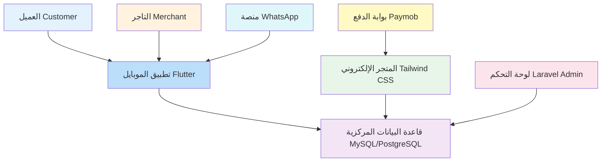
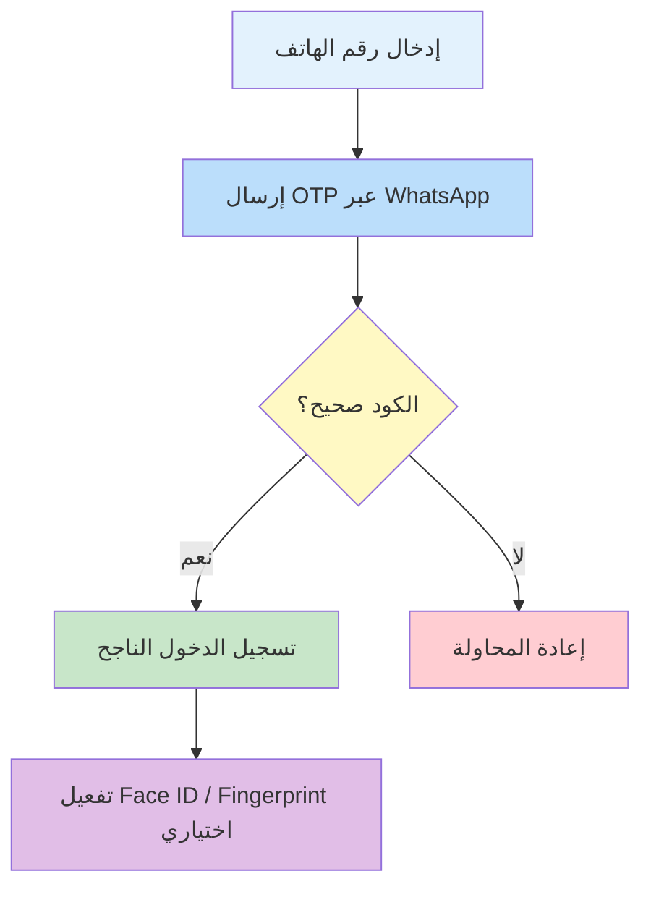
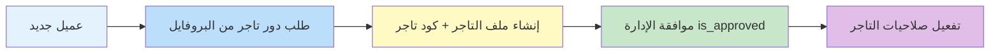
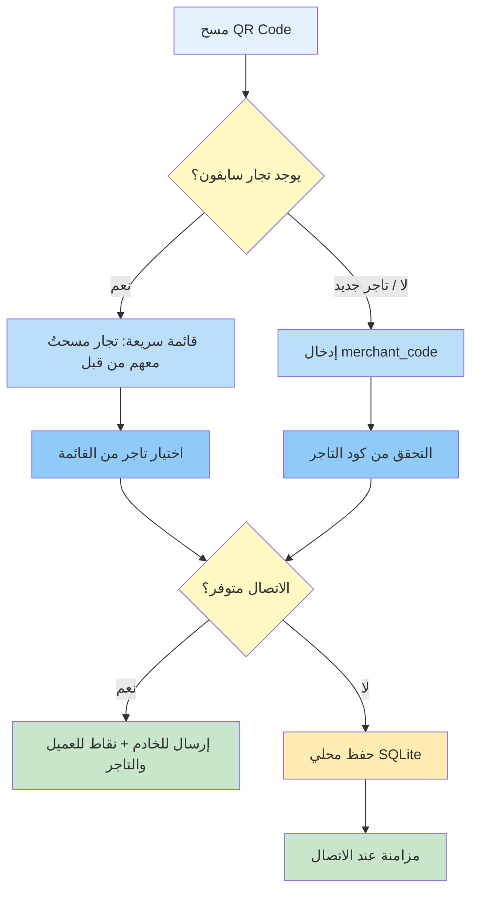
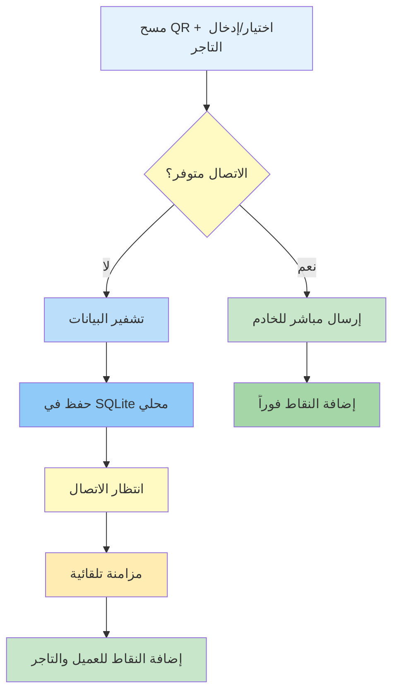
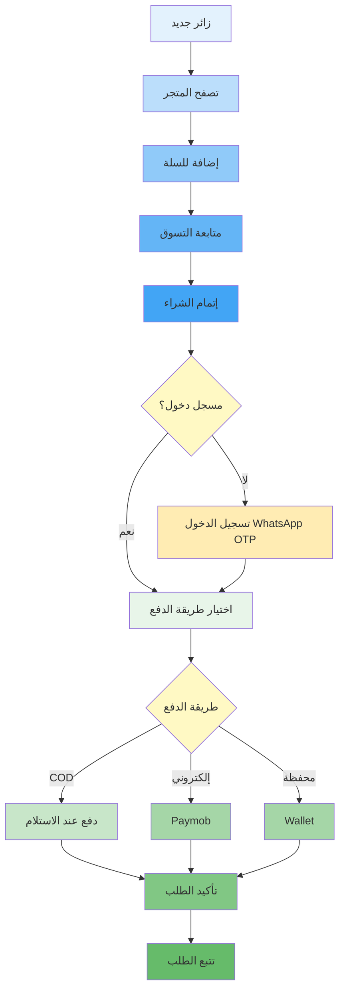
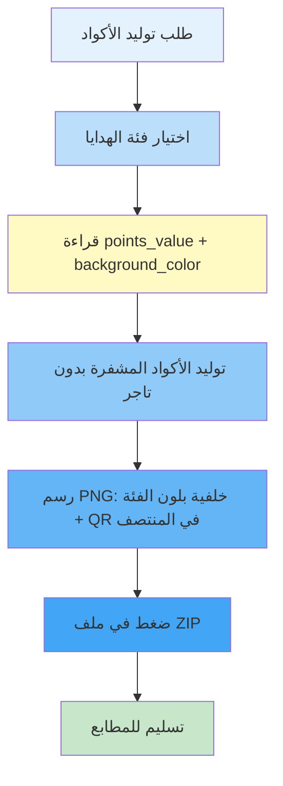
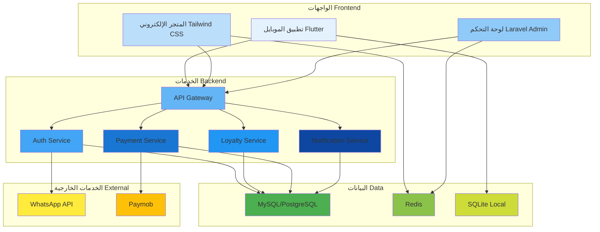

# 🏛️ وثيقة التوصيف الهيكلي والبرمجي
## Loyalty & Rewards Ecosystem

- **المشروع:** maqam-eg.com
- **المرجع الأساسي للـ API:** [https://maqam-eg.com/api/v1/](https://maqam-eg.com/api/v1/)

---

## 📊 نظرة عامة على النظام



---

## 📱 أولاً: واجهة تطبيق الموبايل (Mobile Application - Flutter)

### 🔧 المعلومات التقنية

- **Flutter:** إطار العمل الرئيسي
- **SQLite:** قاعدة البيانات المحلية للعمل دون اتصال
- **WhatsApp API:** إرسال رموز التحقق OTP
- **Face ID / Fingerprint:** المصادقة الحيوية

### 📋 جدول الميزات الرئيسية

- 🔐 **التسجيل والمصادقة:** OTP عبر WhatsApp - الأولوية: ⭐⭐⭐
- 👥 **نظام الأدوار:** عميل / تاجر مع ترقية الحساب - الأولوية: ⭐⭐⭐
- 📷 **مسح الأكواد:** QR Code مع طبقة قشط - الأولوية: ⭐⭐⭐
- 📡 **العمل دون اتصال:** مزامنة تلقائية عند العودة للإنترنت - الأولوية: ⭐⭐⭐
- 💰 **محفظة الولاء:** نقاط + رتب (Silver/Gold/Platinum) - الأولوية: ⭐⭐⭐
- 🎰 **عجلة الحظ:** تلعيب بمكافآت مرتبطة بالرتبة - الأولوية: ⭐⭐

---

### 🔐 التسجيل والمصادقة (Authentication)



**خطوات العمل:**
1. ✅ إدخال رقم الهاتف
2. ✅ استقبال كود التحقق عبر WhatsApp
3. 🔓 تفعيل المصادقة الحيوية (Face ID / Fingerprint)

---

### 👥 نظام الأدوار (User Roles)

- **الدور:** عميل Customer - **الوصف:** الدور الافتراضي للمستخدمين الجدد - **الصلاحيات:** مسح الأكواد، كسب النقاط، التسوق
- **الدور:** تاجر Merchant - **الوصف:** دور مخصص للتجار (يتطلب موافقة الإدارة) - **الصلاحيات:** كود تاجر خاص (`merchant_code`)، استقبال نقاط المسح
- **الدور:** مدير Admin - **الوصف:** صلاحيات لوحة التحكم - **الأنواع:** `super_admin` / `content_manager` / `support` / `finance`

**مسار ترقية التاجر:**


---

### 📷 مسح الأكواد والعمل دون اتصال (Scanning & Offline Mode)

- **الوضع:** متصل Online - **الوصف:** مسح + اختيار تاجر + إضافة فورية للنقاط - **التزامن:** ✅ فوري
- **الوضع:** غير متصل offline - **الوصف:** تشفير + حفظ محلي (SQLite) مع التاجر المختار - **التزامن:** ⏳ عند الاتصال

**ربط التاجر وقت المسح (وليس عند توليد الكود):**
1. العميل يمسح QR
2. يدخل `merchant_code` لأول مرة عند الشراء من تاجر
3. في المسحات التالية: تظهر **قائمة التجار اللي سبق وربطهم بمسحاته** فقط (مش كل التجار) لاختيار سريع — لو معاه 100 علبة مايدخلش الكود 100 مرة
4. القائمة تُبنى من تاريخ `qr_scans` الخاص بهذا العميل



**آلية العمل دون اتصال:**


---

### 💰 محفظة الولاء والرتب (Wallet & Ranks)

#### نظام الرتب (ولاء العميل)

الرتب تُحدد من رصيد/إجمالي نقاط العميل (`ranks.min_points` / `max_points`) وتؤثر على عجلة الحظ ونقاط التاجر الافتراضية:

- **الرتبة:** 🥈 فضية Silver - **النقاط المطلوبة:** حسب إعدادات `ranks` - **المزايا:** أساسيات الولاء + احتمالية عجلة أقل
- **الرتبة:** 🥇 ذهبية Gold - **النقاط المطلوبة:** حسب إعدادات `ranks` - **المزايا:** مكافآت محسّنة + احتمالية أعلى
- **الرتبة:** 💎 بلاتينية Platinum - **النقاط المطلوبة:** حسب إعدادات `ranks` - **المزايا:** مزايا حصرية + أعلى فرصة في عجلة الحظ

**مؤشر التقدم:**
```
الرتبة الحالية: 🥈 فضية
████████░░░░░░░░░░░░ 40% (400/1000)
```

#### توزيع النقاط عند المسح (حسب فئة الهدايا)

> النقاط **ثابتة لكل كود QR** بناءً على فئة الهدايا (`categories_prize.points_value` → تُخزَّن في `qr_codes.points_awarded`)، وليست حسب رتبة المنتج القديمة.

- **المصدر:** جدول `categories_prize` - **النوع:** `gift` - **الحقل:** `points_value` (نقاط ثابتة للهدية)
- **على الكود:** `qr_codes.category_id` + `qr_codes.points_awarded`
- **عند المسح:** العميل يختار/يدخل تاجر → يحصل على النقاط الثابتة للكود، والتاجر (إن وُجد) يحصل على `ranks.merchant_points_per_scan`
- **فئات المتجر:** جدول `categories` منفصل لفئات منتجات المتجر الإلكتروني (تسلسل هرمي + slug) ولا يحدد نقاط المسح

**مثال توضيحي (قيم قابلة للتعديل من لوحة التحكم):**

- **فئة هدية A** → 10 نقاط للعميل (مثبّتة على الكود)
- **فئة هدية B** → 25 نقطة للعميل
- **فئة هدية C** → 50 نقطة للعميل

---

### 🎰 التلعيب والمكافآت (Gamification)

#### عجلة الحظ (Lucky Wheel)

- **الرتبة:** فضية Silver - **تكلفة المحاولة:** 50 نقطة - **احتمالية الفوز:** 20%
- **الرتبة:** ذهبية Gold - **تكلفة المحاولة:** 50 نقطة - **احتمالية الفوز:** 35%
- **الرتبة:** بلاتينية Platinum - **تكلفة المحاولة:** 50 نقطة - **احتمالية الفوز:** 50%

**الجوائز المتاحة** (`prize_type`):
- 🎁 نقاط إضافية (`points`)
- 🎟️ خصم (`discount`)
- 🏷️ كوبون (`coupon`)
- ❌ بدون جائزة (`none`)

---

## 💻 ثانياً: واجهة المتجر الإلكتروني (Web Store - Tailwind CSS)

### 🔧 المعلومات التقنية

- **Tailwind CSS:** تصميم الواجهة
- **Redis:** مزامنة السلة لحظياً
- **Paymob:** بوابة الدفع الإلكتروني
- **COD:** الدفع عند الاستلام

### 📋 جدول الميزات الرئيسية

- 🛒 **التصفح المفتوح:** تصفح بدون تسجيل دخول - الأولوية: ⭐⭐⭐
- 🤖 **ChatBot:** الإجابة على الأسئلة الشائعة - الأولوية: ⭐⭐
- 🔄 **السلة الموحدة:** مزامنة بين الويب والموبايل - الأولوية: ⭐⭐⭐
- 💳 **إتمام الشراء:** COD + Paymob + Wallet - الأولوية: ⭐⭐⭐
- 📦 **تتبع الطلبات:** دورة حياة واضحة - الأولوية: ⭐⭐⭐
- 🎯 **آلية النقاط:** QR مرتبط بفئة هدايا + طبقة قشط - الأولوية: ⭐⭐⭐

---

### 🛒 رحلة الشراء (Checkout Flow)



---

### 🔄 السلة الموحدة (Unified Cart)

- **المنصة:** تطبيق الموبايل - **المزامنة:** ✅ لحظية - **التقنية:** Redis
- **المنصة:** المتجر الإلكتروني - **المزامنة:** ✅ لحظية - **التقنية:** Redis

**الميزة:** السلة متزامنة بين المنصتين ومرتبطة بحساب العميل.

---

### 📦 دورة حياة الطلب

حالات الطلب (`orders.status`): `new` → `processing` → `shipped` → `delivered`، مع مسارات فرعية `cancelled` / `refunded`.

- **المرحلة:** 1️⃣ - **الحالة:** جديد (`new`) - **الوصف:** تم استلام الطلب
- **المرحلة:** 2️⃣ - **الحالة:** جاري التجهيز (`processing`) - **الوصف:** يتم تحضير المنتجات
- **المرحلة:** 3️⃣ - **الحالة:** تم الشحن (`shipped`) - **الوصف:** المنتج في الطريق
- **المرحلة:** 4️⃣ - **الحالة:** تم التسليم (`delivered`) - **الوصف:** وصل للعميل
- **مسارات أخرى:** ملغى (`cancelled`) / مسترد (`refunded`)

```
الطلب #12345: [جديد] → [جاري التجهيز] → [تم الشحن] → [تم التسليم]
              ⬜️      ⬜️           ⬜️           ⬜️
```

---

### 🎯 آلية كسب النقاط الإلكترونية

> ⚠️ **مهم:** المشتريات من المتجر الإلكتروني لا تضيف النقاط تلقائياً لتجنب الاحتيال.

**العملية:**
1. 🛒 الشراء من المتجر الإلكتروني (فئات المنتجات عبر `categories`)
2. 📦 شحن المنتج مع QR Code مغطى بطبقة قشط — فئة هدايا + نقاط ثابتة فقط (**بدون تاجر**)
3. 📱 مسح الكود عبر التطبيق + إدخال/اختيار `merchant_code` (قائمة التجار السابقين للعميل)
4. 💰 إضافة النقاط الثابتة للعميل + نقاط التاجر إن وُجد، وتسجيل المعاملة في `points_transactions` / `qr_scans`

---

## ⚙️ ثالثاً: واجهة لوحة التحكم (Admin Dashboard - Laravel)

### 🔧 المعلومات التقنية

- **Laravel:** إطار العمل الخلفي
- **RBAC:** نظام الصلاحيات
- **MySQL/PostgreSQL:** قاعدة البيانات

### 📋 جدول الأنظمة الفرعية

- 🔢 **QR & Serial Engine:** توليد وتصدير الأكواد - الأولوية: ⭐⭐⭐
- 🛡️ **Anti-Fraud Engine:** الحماية من الاحتيال - الأولوية: ⭐⭐⭐
- 🤖 **AI Insights:** تحليل المبيعات وأوقات الذروة - الأولوية: ⭐⭐
- 🎮 **Loyalty Control:** إدارة الولاء والتلعيب - الأولوية: ⭐⭐⭐
- 📢 **Notifications Engine:** إدارة الإشعارات - الأولوية: ⭐⭐
- 📦 **Inventory Management:** إدارة المخزون - الأولوية: ⭐⭐⭐

---

### 🔢 نظام الأكواد والتصدير (QR & Serial Engine)

- **المواصفة:** طول الكود - **القيمة:** 16 رقم (`serial_code`)
- **المواصفة:** التشفير - **القيمة:** معقد وغير قابل للتخمين
- **المواصفة:** الاستخدام - **القيمة:** لمرة واحدة فقط (`active` → `used` / `expired`)
- **المواصفة:** الفئة - **القيمة:** ربط بفئة هدايا + نسخ `points_awarded` على كل كود
- **المواصفة:** لون الخلفية - **القيمة:** من `categories_prize.background_color` (HEX) — يُطبَع خلف QR في صورة PNG (مثال: فئة 1 = أخضر)
- **المواصفة:** التاجر - **القيمة:** **لا يُربط عند التوليد** — الربط وقت المسح فقط
- **المواصفة:** السعة - **القيمة:** حتى 5,000 كود في الدفعة (`batch_id`)
- **المواصفة:** التنسيق - **القيمة:** PNG بخلفية لون الفئة، مضغوط في ZIP

**عملية التوليد:**


**مثال ألوان الطباعة:**
- فئة Prize 1 → خلفية خضراء `#22C55E` → كل QR لهذه الفئة يُطبَع PNG بخلفية خضراء
- فئة Prize 2 → خلفية زرقاء `#3B82F6` → PNG بخلفية زرقاء
- فئة Prize 3 → خلفية ذهبية `#C5A059` → PNG بخلفية ذهبية

---

### 🛡️ نظام الحماية من الاحتيال (Anti-Fraud & Risk Engine)

- **آلية الحماية:** 🌍 Geo-velocity - **الوصف:** رصد مسح متباعد جغرافياً في وقت مستحيل - **الإجراء:** تجميد الحساب تلقائياً
- **آلية الحماية:** 🔢 تكرار الأخطاء - **الوصف:** إدخال أكواد غير صحيحة بمعدل مرتفع - **الإجراء:** تجميد الحساب تلقائياً

**مستويات المخاطر:**

- **المستوى:** 🟢 منخفض - **الوصف:** نشاط طبيعي - **الإجراء:** لا شيء
- **المستوى:** 🟡 متوسط - **الوصف:** نشاط مشبوه - **الإجراء:** مراقبة إضافية
- **المستوى:** 🔴 عالي - **الوصف:** احتيال واضح - **الإجراء:** تجميد فوري

---

### 🤖 الذكاء الاصطناعي والتحليلات (AI Insights)

- **القدرة:** 📊 Sales Analytics - **الوصف:** تحليل بيانات المبيعات
- **القدرة:** ⏰ Peak Hours - **الوصف:** تحديد أوقات الذروة

---

### 🎮 إدارة الولاء والتلعيب (Loyalty & Gamification Control)

#### فئات الهدايا والنقاط الثابتة (`categories_prize`)

- إدارة فئات الهدايا (`gift`) وتحديد `points_value` و`background_color` لكل فئة
- عند توليد الأكواد تُنسخ القيمة إلى `qr_codes.points_awarded` ويُستخدم لون الفئة كخلفية صور PNG المطبوعة
- فئات المتجر (`categories`) منفصلة ولا تدخل في حساب نقاط المسح

#### إعدادات الرتب (`ranks`)

- **الرتبة:** فضية / ذهبية / بلاتينية — حدود النقاط (`min_points` / `max_points`)
- **نقاط المسح الافتراضية:** `customer_points_per_scan` / `merchant_points_per_scan`
- **عجلة الحظ لكل رتبة:** `wheel_cost_points` + `wheel_win_probability`

#### إعدادات عجلة الحظ

- **الإعداد:** التشغيل - **القيمة:** عبر `system_settings` (مجموعة `wheel`)
- **الإعداد:** تكلفة المحاولة - **القيمة:** حسب الرتبة (افتراضي 50)
- **Layer 1 — احتمالية الفوز:** حسب الرتبة (مثال: 20% / 35% / 50%) عبر `ranks.wheel_win_probability`
- **Layer 2 — جوائز العجلة:** جدول `wheel_prizes` (نقاط / كوبون / منتج / خصم) بأوزان نسبية؛ تُختار الجائزة فقط بعد نجاح Layer 1
- **الخدمة:** `App\Services\WheelSpinService` تخصم التكلفة وتوزّع الجائزة وتسجّل `wheel_spins`

---

### 📢 إدارة الإشعارات (Notifications Engine)

#### معايير التجزئة

- **المعيار:** 🏆 الرتبة - **الخيارات:** فضية، ذهبية، بلاتينية
- **المعيار:** 🌍 الموقع الجغرافي - **الخيارات:** القاهرة، الإسكندرية، إلخ
- **المعيار:** 📊 السلوك - **الخيارات:** نشط، غير نشط، جديد

#### أنواع الإشعارات (`notifications.type`)

- **النوع:** 🎉 ترقية الرتبة (`rank_upgrade`) - **الاستخدام:** عند الانتقال لرتبة أعلى
- **النوع:** 🎁 عروض خاصة (`offer`) - **الاستخدام:** خصومات حصرية
- **النوع:** ⏰ تذكير (`reminder`) - **الاستخدام:** تنشيط العملاء غير النشطين
- **النوع:** 📦 حالة الطلب (`order_update`) - **الاستخدام:** تحديثات الشحن
- **النوع:** 📢 ترويج (`promotion`) - **الاستخدام:** حملات ترويجية

---

### 📦 إدارة المتجر والمخزون (Inventory Management)

- **الميزة:** 📋 الكتالوج - **الوصف:** إدارة المنتجات
- **الميزة:** 📊 المخزون المركزي - **الوصف:** تتبع الكميات
- **الميزة:** ⚠️ تنبيهات انخفاض المخزون - **الوصف:** Low-stock alerts عبر واتساب

**مستويات المخزون:**

- **المستوى:** 🟢 عالي - **الحالة:** > 100 وحدة - **الإجراء:** طبيعي
- **المستوى:** 🟡 متوسط - **الحالة:** 50-100 وحدة - **الإجراء:** مراقبة
- **المستوى:** 🔴 منخفض - **الحالة:** < 50 وحدة - **الإجراء:** طلب إعادة تعبئة
- **المستوى:** ⚫ نفاد - **الحالة:** 0 وحدة - **الإجراء:** تنبيه عاجل

---

## 🏗️ معلومات هيكلية إضافية (Infrastructure)

### 🌍 البيانات واللغات (Localization)

- **العنصر:** 🗣️ اللغات - **الدعم:** عربي / إنجليزي
- **العنصر:** 📝 أسماء المنتجات - **الدعم:** ديناميكي باللغتين
- **العنصر:** 🔔 الإشعارات - **الدعم:** ديناميكي باللغتين
- **العنصر:** 🎨 الواجهة - **الدعم:** RTL / LTR

---

### 💻 البنية التقنية (Tech Stack)

- **الطبقة:** قاعدة البيانات - **التقنية:** MySQL / PostgreSQL
- **الطبقة:** البروتوكول - **التقنية:** ACID
- **الطبقة:** الضمان - **التقنية:** عدم ضياع أو تكرار النقاط
- **الطبقة:** الأداء - **التقنية:** دعم الضغط العالي

### 📊 مخطط البنية



---

**آخر تحديث:** يوليو 2026  
**الإصدار:** 1.3 — لون خلفية طباعة QR لكل فئة هدايا (`background_color`)؛ PNG بخلفية الفئة + ZIP للمطابع
