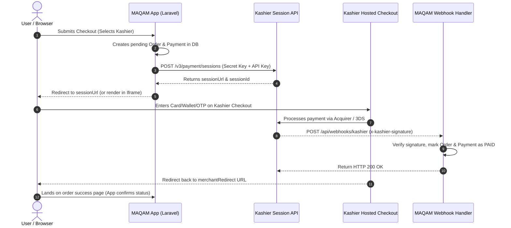

# Kashier Payment Gateway — Agent Knowledge & Integration Manual

> **Scope:** Comprehensive architectural reference, cryptographic hashing specs, API endpoints, webhook handling, testing triggers, and implementation blueprint for integrating **Kashier (Egypt)** into **MAQAM (`maqam-eg.com`)**.
> **Source:** Synthesized and verified against official documentation at [developers.kashier.io](https://developers.kashier.io/) (`llms-full.txt` & OpenAPI v3.1 spec).

---

## 1. Overview & Architectural Foundations

Kashier is an Egyptian payment gateway offering omnichannel payment collection tailored to the Egyptian market:
* **Cards:** Visa, MasterCard, Meeza (Egypt's national card scheme).
* **Mobile Wallets:** Vodafone Cash, Orange Money, Etisalat Cash, WE Pay, and all Meeza Digital / Tahweel wallets via Request to Pay (R2P).
* **InstaPay:** Instant Payment Network (IPN) collection via dynamic QR or Request to Pay.
* **Bank Installments:** 0% interest and structured installment plans through major Egyptian banks (CIB, Banque Misr, NBE, QNB, etc.).
* **Buy Now Pay Later (BNPL):** valU, Souhoola, Contact, Octo, Sympl, Mogo, Tru, Forsa.
* **Cash & Kiosks:** Basata (formerly Aman / Masary) kiosk reference numbers.
* **Card Tokenization:** Secure card-on-file tokenization for one-click checkout and subscriptions.

### Environments & Hostnames

Kashier separates traffic across dedicated hosts based on whether an operation is **customer-facing payment processing (FEP)**, **merchant management (Dashboard/API)**, or **hosted checkout**:

| Component | Test Environment (Sandbox) | Live Production Environment |
| :--- | :--- | :--- |
| **Management / Sessions API** | `https://test-api.kashier.io` | `https://api.kashier.io` |
| **Direct Payment FEP (Front-End Processor)** | `https://test-fep.kashier.io` | `https://fep.kashier.io` |
| **Hosted Checkout UI** | `https://payments.kashier.io` | `https://payments.kashier.io` |

> [!NOTE]
> The hosted checkout hostname (`payments.kashier.io`) is identical across modes. The environment is determined by the `mode=test` or `mode=live` query parameter generated inside the `sessionUrl`.

---

## 2. Credentials & Authentication Model

Every Kashier merchant account has **four distinct keys** (two per environment) plus a Merchant ID:

| Credential | Where to Find in Dashboard | Protocol Usage & HTTP Header | Purpose |
| :--- | :--- | :--- | :--- |
| **Merchant ID (`MID`)** | Top navigation bar under user profile | JSON body `merchantId` or query `mid` | Identifies your merchant merchant account (`MID-XXXX-XXXX`). |
| **Payment API Key** | Dashboard > Integrations > API Keys | Sent in `api-key` header or kept secret for hashing | **Shared HMAC secret.** Used to compute Order Hashes, verify 3DS redirect signatures, and verify webhook signatures (`x-kashier-signature`). |
| **Secret Key** | Dashboard > Integrations > Secret Keys | `Authorization: <SECRET_KEY>` *(Raw string, NOT Bearer)* | **Server-to-Server credential.** Authenticates session creation, order search, refund, void, and balance queries. |

### Critical Authentication Rules:
1. **Raw Authorization Header:** Send `Authorization: {secret_key}`. Never prepend `Bearer `.
2. **Mode-Scoped Keys:** A test `Payment API Key` only validates against `test-*` hosts. A live key only validates on production hosts. Mismatched modes will result in `403 INVALID_HASH_CHECK`.
3. **Multi-Merchant Accounts:** If an API user manages multiple MIDs, pass `authmerchantid: MID-XXXX-XXXX` header alongside `Authorization`.
4. **IP Allow-List Trap:** Kashier supports an IP allow-list for Secret Key calls (`Dashboard > Integrations > IP Allow-list`). An **empty** list permits all IPs. However, the moment **one** IP is added, requests from unlisted IPs fail with `403 Unauthorized IP address`. Ensure server egress IPs are allow-listed before going live.

---

## 3. Cryptographic Signatures & Hashing (Deterministic Specs)

Kashier relies on SHA256 HMAC signatures to prevent client-side price tampering and guarantee message authenticity. All HMAC operations use the **Payment API Key** as the hashing secret.

### A. Order Hash Generation (Request Hashing)

When submitting direct payments (`POST /v3/orders/`) or creating client-side tokens, generate the `Kashier-Hash` header using HMAC-SHA256:

* **Formula for Standard One-Off Payment:**
  $$\text{Payload} = \text{"/?payment="} + \text{MID} + \text{"."} + \text{orderId} + \text{"."} + \text{amount} + \text{"."} + \text{currency}$$
  *Example string to sign:* `/?payment=MID-123-123.99.100.EGP`
  *Amount format:* Coerce to number or string without extra zeroes if integer (e.g. `100` or `100.00`). Joined with literal dots (`.`) — **do not URL-encode**.

* **Formula with Customer Reference (Tokenization / Saved Cards):**
  $$\text{Payload} = \text{"/?payment="} + \text{MID} + \text{"."} + \text{orderId} + \text{"."} + \text{amount} + \text{"."} + \text{currency} + \text{"."} + \text{customerReference}$$

* **Formula for Customer Saved Token CRUD:**
  $$\text{Payload} = \text{"/?tokenization="} + \text{MID} + \text{"."} + \text{customerReference}$$

```php
function generateKashierOrderHash(string $mid, string $orderId, float|string $amount, string $currency, string $apiKey, ?string $customerRef = null): string
{
    $path = "/?payment={$mid}.{$orderId}.{$amount}.{$currency}";
    if (!empty($customerRef)) {
        $path .= ".{$customerRef}";
    }
    return hash_hmac('sha256', $path, $apiKey, false);
}
```

---

### B. Redirect Response Signature Verification

When a customer completes or cancels payment and is returned to your `merchantRedirect` URL, Kashier appends GET query parameters including a `signature`.

**Verification Procedure:**
Reconstruct the query string using the exact **fixed parameter order**:
1. `paymentStatus`
2. `cardDataToken`
3. `maskedCard`
4. `merchantOrderId`
5. `orderId`
6. `cardBrand`
7. `orderReference`
8. `transactionId`
9. `amount`
10. `currency`

Any parameter absent from the query must be represented as the literal string `'null'`.

```php
function validateKashierRedirectSignature(array $query, string $paymentApiKey): bool
{
    $fields = [
        'paymentStatus', 'cardDataToken', 'maskedCard', 'merchantOrderId', 'orderId',
        'cardBrand', 'orderReference', 'transactionId', 'amount', 'currency'
    ];
    
    $parts = [];
    foreach ($fields as $field) {
        $val = $query[$field] ?? 'null';
        $parts[] = "{$field}={$val}";
    }
    
    $payload = implode('&', $parts);
    $expectedSignature = hash_hmac('sha256', $payload, $paymentApiKey, false);
    
    return hash_equals($expectedSignature, $query['signature'] ?? '');
}
```

---

### C. Webhook Signature Verification (`x-kashier-signature`)

Kashier delivers asynchronous notifications via POST with a JSON body containing `event` and `data`. The `x-kashier-signature` HTTP header contains the HMAC-SHA256 signature.

**Computation Steps:**
1. Extract `data` from the JSON payload.
2. Read the array `data.signatureKeys`.
3. Sort `signatureKeys` alphabetically (`sort($signatureKeys)`).
4. Extract the keys and values from `data`.
5. URL-encode each value using **RFC 3986** (spaces become `%20`, pipes `|` become `%7C`).
6. Concatenate with `key=encoded_value` separated by `&`.
7. Compute `hash_hmac('sha256', $queryString, $paymentApiKey)`.
8. Compare with header `x-kashier-signature` using `hash_equals()`.

```php
function validateKashierWebhookSignature(array $jsonPayload, string $receivedSignature, string $paymentApiKey): bool
{
    if (empty($jsonPayload['data']) || empty($jsonPayload['data']['signatureKeys'])) {
        return false;
    }

    $data = $jsonPayload['data'];
    $keys = $data['signatureKeys'];
    sort($keys);

    $pairs = [];
    foreach ($keys as $key) {
        $val = $data[$key] ?? '';
        // RFC 3986 URL-encoding on values only
        $pairs[] = $key . '=' . rawurlencode((string)$val);
    }

    $signaturePayload = implode('&', $pairs);
    $calculated = hash_hmac('sha256', $signaturePayload, $paymentApiKey, false);

    return hash_equals(strtolower($calculated), strtolower($receivedSignature));
}
```

---

## 4. Primary Integration Flow: Payment Sessions & Hosted Checkout

The **Payment Sessions API** is Kashier's recommended pattern for web and mobile web checkouts. It keeps sensitive card numbers away from your servers, drastically reducing PCI DSS compliance overhead while providing cards, wallets, Meeza, and Apple Pay seamlessly.



### Step 1: Create a Payment Session
* **Endpoint:** `POST https://test-api.kashier.io/v3/payment/sessions` (Production: `https://api.kashier.io/v3/payment/sessions`)
* **Headers:**
  ```http
  Authorization: YOUR_SECRET_KEY
  api-key: YOUR_PAYMENT_API_KEY
  Content-Type: application/json
  ```
* **Request Body:**
  ```json
  {
    "amount": "165.00",
    "currency": "EGP",
    "order": "MQ-ORD-10024",
    "merchantId": "MID-XXXX-XXXX",
    "merchantRedirect": "https://maqam-eg.com/payment/kashier/callback",
    "serverWebhook": "https://maqam-eg.com/api/webhooks/kashier",
    "display": "ar",
    "type": "one-time",
    "allowedMethods": "card,wallet",
    "brandColor": "#C5A059",
    "customer": {
      "reference": "CUST-58",
      "email": "customer@example.com"
    },
    "description": "MAQAM Order #10024"
  }
  ```
* **Response:**
  ```json
  {
    "status": "SUCCESS",
    "session": {
      "sessionId": "67adc07584f10c00121f6739",
      "sessionUrl": "https://payments.kashier.io/session/67adc07584f10c00121f6739?mode=test"
    }
  }
  ```

### Step 2: Handle Checkout Presentation
Redirect the user's browser to `sessionUrl`. If embedding within a modal or `<iframe>`, listen to postMessages:
* `paymentSuccess`: Indicates payment succeeded in browser (always verify server-side).
* `urlRedirection`: Contains `{ redirectUrl }` for top-level navigation.
* `closeIframe`: User dismissed the modal.

### Step 3: Verify the Result Server-Side
Never rely exclusively on client redirection. Verify the session state:
* **Endpoint:** `GET https://test-api.kashier.io/v3/payment/sessions/{sessionId}/payment`
* **Header:** `Authorization: YOUR_SECRET_KEY`

---

## 5. Direct API Integration (Custom UI / Native Mobile)

For a fully white-labeled checkout or native Flutter/Android apps:

### A. Custom Card Payment & 3D Secure
* **Endpoint:** `POST https://test-fep.kashier.io/v3/orders/`
* **Headers:**
  ```http
  Kashier-Hash: <computed_order_hash>
  Content-Type: application/json
  ```
* **Body:**
  ```json
  {
    "apiOperation": "PAY",
    "merchantId": "MID-XXXX-XXXX",
    "paymentMethod": {
      "type": "CARD",
      "card": {
        "number": "XXXXXXXXXXXX0001",
        "nameOnCard": "Nour Sallam",
        "expiry": { "month": "05", "year": "26" },
        "securityCode": "100",
        "save": false
      }
    },
    "order": {
      "reference": "MQ-ORD-10024",
      "amount": "165.00",
      "currency": "EGP",
      "description": "Order 10024"
    },
    "interactionSource": "ECOMMERCE",
    "reconciliation": {
      "webhookUrl": "https://maqam-eg.com/api/webhooks/kashier",
      "merchantRedirect": "https://maqam-eg.com/payment/kashier/callback",
      "redirect": true
    }
  }
  ```
* **3DS Challenge Handling:** If challenged, response contains `response.authentication.redirectUrl`. Load this URL inside an iframe or webview. Listen for message `'merchantStoreRedirect'`.

### B. Mobile Wallet Payments (Request to Pay / R2P)
1. **Initiate:**
   * `POST https://test-fep.kashier.io/v3/orders/`
   * Body:
     ```json
     {
       "apiOperation": "INITIATE_R2P",
       "paymentMethod": { "type": "wallet" },
       "order": { "reference": "PM-1711283427747", "amount": 165, "currency": "EGP" },
       "customer": { "mobilePhone": "01001001001" },
       "interactionSource": "ECOMMERCE",
       "reconciliation": { "webhookUrl": "https://maqam-eg.com/api/webhooks/kashier" },
       "merchantId": "MID-XXXX-XXXX"
     }
     ```
2. **Reconcile Status:**
   * `PUT https://test-fep.kashier.io/v3/orders/{systemOrderId}` with `{"apiOperation": "RECONCILE_WALLET", "paymentMethod": {"type": "wallet"}, "merchantId": "..."}`.
   * Note: Error `k_5` indicates the phone number is not registered on any wallet network (terminal failure).

### C. Meeza Card acceptance
* Submit with `paymentMethod.type = "CARD"`. Meeza cards are processed identically to Visa/MasterCard. Tokenization for recurring payments is not permitted on Meeza.

---

## 6. Webhook Engineering & Resiliency

Webhooks are the authoritative source of payment completion.

### Request Payload Format:
```json
{
  "event": "pay",
  "data": {
    "amount": 165,
    "channel": "online | e-commerce",
    "currency": "EGP",
    "kashierOrderId": "9ad06b17-755b-4e21-9774-aff3e2726ac9",
    "merchantOrderId": "MQ-ORD-10024",
    "method": "card",
    "orderReference": "TEST-ORD-38855",
    "status": "SUCCESS",
    "transactionId": "TX-249893963",
    "transactionResponseCode": "00",
    "signatureKeys": [
      "amount", "channel", "currency", "kashierOrderId", "merchantOrderId",
      "method", "orderReference", "status", "transactionId", "transactionResponseCode"
    ]
  }
}
```

### Critical Webhook Guidelines:
1. **Never Trust `event` Alone:** Kashier sends the same `event: "pay"` for failed transactions. Always check `data.status == "SUCCESS"`.
2. **Immediate HTTP 200 Acknowledgment:** Return HTTP `200` with an empty body within 30 seconds. If already processed, return `200` or `409 Conflict`.
3. **Retry Schedule:** Unacknowledged webhooks are retried up to 10 times at intervals of: 2m, 10m, 30m, 1h, 2h, 4h, and every 4h thereafter.
4. **Idempotency:** Webhook handlers must be idempotent. Store the `transactionId` in `payments.transaction_id` and avoid double-crediting points or updating order status if already finalized.

---

## 7. Order Operations: Refunds, Voids, & Reconciliation

### A. Refunds
* **Endpoint:** `PUT https://test-fep.kashier.io/v3/orders/{kashierOrderId}` (or Production: `fep.kashier.io`)
* **Header:** `Authorization: YOUR_SECRET_KEY` *(Requires refund permission on key role)*
* **Body:**
  ```json
  {
    "apiOperation": "REFUND",
    "reason": "Customer cancellation",
    "transaction": {
      "amount": 165.00
    }
  }
  ```
* *Omit `transaction.amount` for a full refund.*

### B. Void (Cancel before daily settlement)
* **Endpoint:** `PUT https://test-fep.kashier.io/v3/orders/{kashierOrderId}`
* **Body:**
  ```json
  {
    "apiOperation": "VOID",
    "reason": "Accidental duplicate order"
  }
  ```

### C. Order Lookup & Reconciliation
* **Endpoint:** `GET https://test-api.kashier.io/v3/payment/orders?search={merchantOrderId}`
* **Header:** `Authorization: YOUR_SECRET_KEY`
* **Field Typo Alert:** The provider reconciliation field returned on each transaction is spelled **`reconcilation`** (with one `i`), whereas the webhook field is **`merchantWebhookReconciliation`** (with two `i`s).
* *Meaning of `reconcilation` values:*
  * `OK`: Gateway and Kashier records match (could be a reconciled success OR a reconciled failure).
  * `Failed` / `Not_Exists`: Discrepancy detected.
  * `NA`: Not yet reconciled.

---

## 8. Test Data & Simulation Cheat Sheet

Kashier drives sandbox outcomes deterministically using card numbers, CVVs, and expiry dates:

### Test Cards

| Card Type | Card Number | Notes |
| :--- | :--- | :--- |
| **MasterCard (3DS Enrolled)** | `5123450000000008` | Primary card for testing 3DS redirect and OTP flow |
| **MasterCard** | `5111111111111118` | Standard non-3DS test card |
| **Visa (3DS Enrolled)** | `4508750015741019` | Visa 3DS verification |
| **Visa** | `4012000033330026` | Standard Visa |
| **Mobile Wallet** | `01001001001` | Vodafone Cash sandbox number |

### Expiry Date Outcome Triggers (Test Mode Only)
In test mode, the expiry date is an outcome selector, not an expiration date:

| Expiry (`MM/YY`) | Transaction Result Code | Meaning |
| :--- | :--- | :--- |
| `06/25` | `APPROVED` | Successful payment |
| `05/25` | `DECLINED` | Insufficient funds / general decline |
| `04/27` | `EXPIRED_CARD` | Simulated expired card error |
| `08/28` | `TIMED_OUT` | Acquirer timeout |
| `01/37` | `ACQUIRER_SYSTEM_ERROR` | Upstream network failure |
| `02/37` | `UNSPECIFIED_FAILURE` | Gateway unclassified error |
| `05/37` | `UNKNOWN` | Undetermined outcome (requires reconciliation) |

---

## 9. Implementation Blueprint for MAQAM (`maqam-eg.com`)

### 1. Environment Configuration (`.env` and `.env.example`)
```env
KASHIER_MODE=test # test or live
KASHIER_MID=MID-0000-000
KASHIER_PAYMENT_API_KEY=your_test_payment_api_key
KASHIER_SECRET_KEY=your_test_secret_key
KASHIER_CURRENCY=EGP
```

### 2. Laravel Configuration File (`config/kashier.php`)
```php
return [
    'mode' => env('KASHIER_MODE', 'test'),
    'mid' => env('KASHIER_MID'),
    'payment_api_key' => env('KASHIER_PAYMENT_API_KEY'),
    'secret_key' => env('KASHIER_SECRET_KEY'),
    'currency' => env('KASHIER_CURRENCY', 'EGP'),
    'api_url' => env('KASHIER_MODE', 'test') === 'live'
        ? 'https://api.kashier.io'
        : 'https://test-api.kashier.io',
    'fep_url' => env('KASHIER_MODE', 'test') === 'live'
        ? 'https://fep.kashier.io'
        : 'https://test-fep.kashier.io',
];
```

### 3. Dedicated Service Class: `App\Services\Payment\KashierService`
* Encapsulates:
  * `createPaymentSession(Order $order, string $locale = 'ar'): array`
  * `verifySession(string $sessionId): array`
  * `verifyWebhookSignature(array $payload, string $signature): bool`
  * `verifyRedirectSignature(array $queryParams): bool`
  * `refund(string $kashierOrderId, ?float $amount = null, string $reason = ''): array`

### 4. Controller Endpoints: `App\Http\Controllers\Store\KashierPaymentController`
* `initiate(Request $request, Order $order)`: Builds session and redirects to `sessionUrl`.
* `callback(Request $request)`: Handles user return, verifies signature, flashes toast, redirects to order details or profile.
* `webhook(Request $request)`: Unauthenticated API route with CSRF exemption. Validates `x-kashier-signature`, updates `payments` and `orders` tables in a database transaction, and returns HTTP 200.

### 5. Exclude Webhook from CSRF (`bootstrap/app.php`)
```php
->withMiddleware(function (Middleware $middleware) {
    $middleware->validateCsrfTokens(except: [
        'api/webhooks/kashier',
    ]);
})
```

---

## 10. Summary Checklist for Going Live

- [ ] Merchant account activated for live data in Kashier dashboard.
- [ ] Swapped test keys for live `Payment API Key` and live `Secret Key`.
- [ ] Updated base URL configs to live endpoints (`api.kashier.io` and `fep.kashier.io`).
- [ ] Verified server outbound IP is added to the Kashier IP allow-list.
- [ ] Tested live transaction with 5 EGP, verified webhook delivery, and verified refund.
- [ ] Verified `reconcilation` field handling matches exact API wire spelling.
